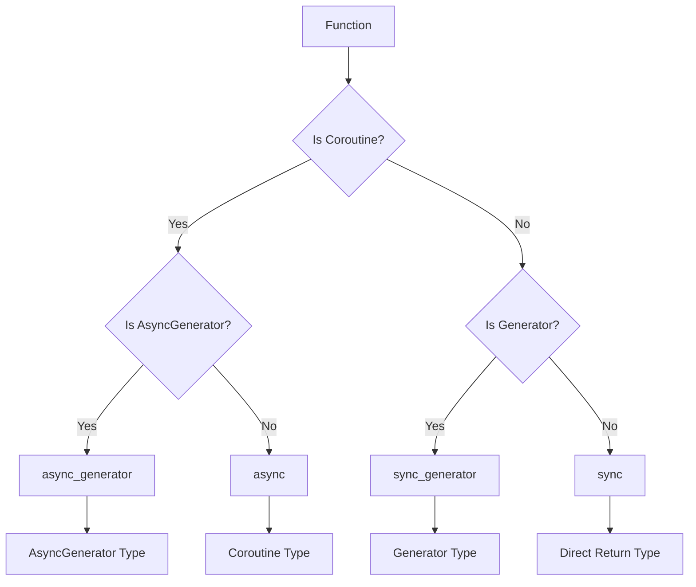
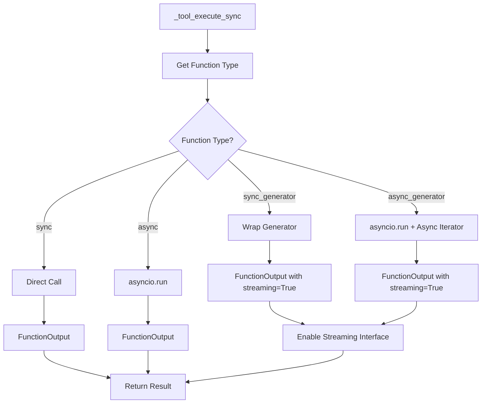
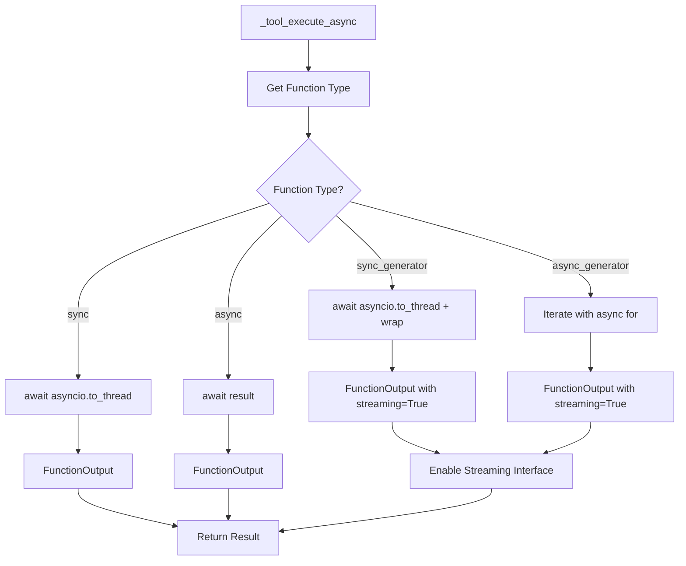
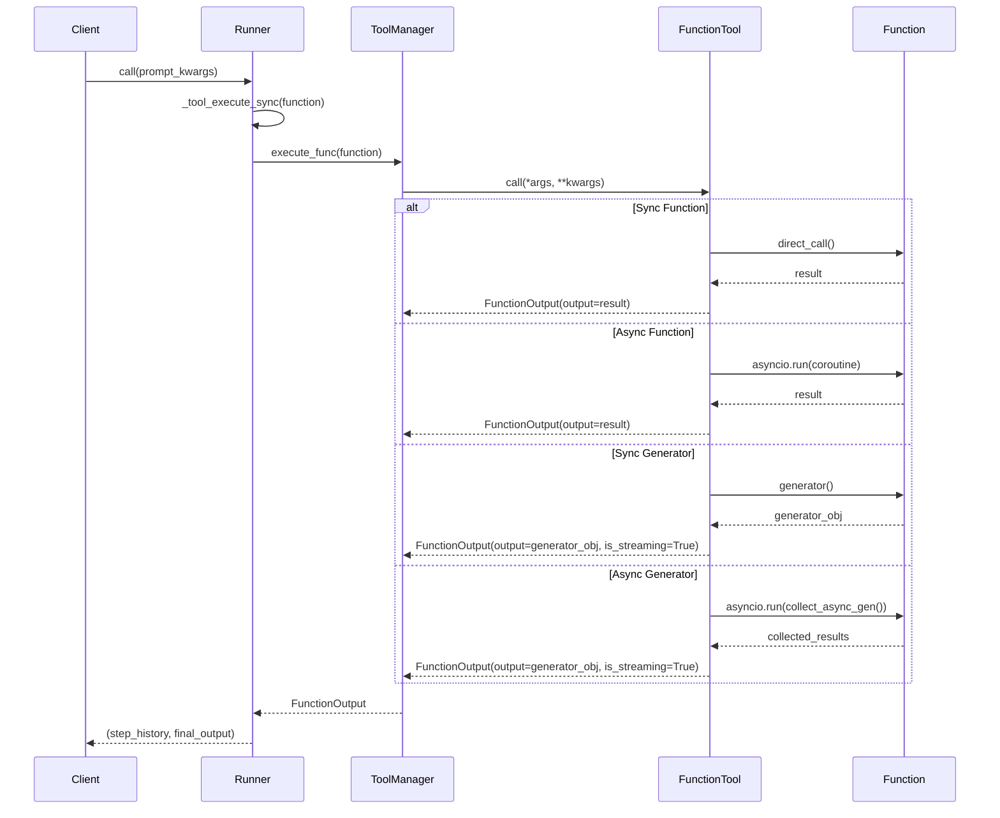
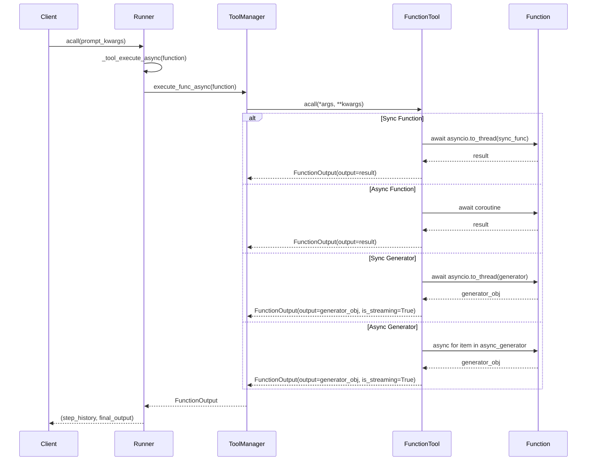

# FunctionTool Support for Multiple Function Types

## Overview

This document outlines the plan to support four types of functions in the AdalFlow Runner system:
1. **Synchronous functions** (`sync`)
2. **Asynchronous functions** (`async`) 
3. **Synchronous generators** (`sync_generator`)
4. **Asynchronous generators** (`async_generator`)

The goal is to enable seamless execution of all function types through `Runner.call()` and `Runner.acall()` while supporting streaming capabilities for generator functions.

## Current State Analysis

### Existing Implementation

#### FunctionTool Class
- ✅ Already detects async functions via `is_async()` method
- ✅ Has `is_async_generator()` method for detection
- ✅ Supports sync execution via `call()` method
- ✅ Supports async execution via `acall()` method
- ❌ Limited generator support and output wrapping

#### Runner Class  
- ✅ Has both `call()` and `acall()` methods
- ✅ Uses `_tool_execute_sync()` and `_tool_execute_async()` for execution
- ⚠️ Partial async generator support (memory shows fix needed)
- ❌ No streaming support for generators
- ❌ Inconsistent FunctionOutput wrapping

#### ToolManager Class
- ✅ Executes functions through context mapping
- ✅ Has async execution support
- ❌ No generator-specific handling
- ❌ No streaming interface

## Function Type Classification



## Output Wrapping Strategy

All function executions should return a consistent `FunctionOutput` structure:

```python
@dataclass
class FunctionOutput:
    name: str
    input: Function
    output: Union[Any, Generator, AsyncGenerator]  # Raw output for generators
    error: Optional[str] = None
    is_streaming: bool = False  # New field to indicate streaming capability
```

### Output Wrapping by Function Type

| Function Type | Output Wrapping | Streaming Support |
|---------------|----------------|-------------------|
| `sync` | `FunctionOutput(output=result)` | No |
| `async` | `FunctionOutput(output=await result)` | No |
| `sync_generator` | `FunctionOutput(output=generator, is_streaming=True)` | Yes |
| `async_generator` | `FunctionOutput(output=async_generator, is_streaming=True)` | Yes |

## Implementation Plan

### Phase 1: Enhanced Function Detection

#### Update FunctionTool class:

```python
class FunctionTool(Component):
    def get_function_type(self) -> Literal["sync", "async", "sync_generator", "async_generator"]:
        """Determine the function type for proper execution strategy."""
        if inspect.isasyncgenfunction(self.fn):
            return "async_generator"
        elif inspect.isgeneratorfunction(self.fn):
            return "sync_generator"
        elif inspect.iscoroutinefunction(self.fn):
            return "async"
        else:
            return "sync"
    
    def is_generator_function(self) -> bool:
        """Check if function returns a generator (sync or async)."""
        return self.get_function_type() in ["sync_generator", "async_generator"]
```

### Phase 2: Enhanced Execution Methods

#### Runner._tool_execute_sync() Enhancement:



#### Runner._tool_execute_async() Enhancement:



### Phase 3: Streaming Interface

#### Generator Streaming Support:

```python
class StreamingFunctionOutput:
    """Wrapper for streaming function outputs."""
    
    def __init__(self, function_output: FunctionOutput):
        self.function_output = function_output
        self._generator = function_output.output
        
    def stream(self) -> Iterator[Any]:
        """Stream results from sync generator."""
        if not self.function_output.is_streaming:
            yield self.function_output.output
            return
            
        for item in self._generator:
            yield item
    
    async def astream(self) -> AsyncIterator[Any]:
        """Stream results from async generator.""" 
        if not self.function_output.is_streaming:
            yield self.function_output.output
            return
            
        async for item in self._generator:
            yield item
```

### Phase 4: Runner Integration

#### Enhanced call() method:

```python
class Runner(Component):
    def call(self, prompt_kwargs: Dict[str, Any], **kwargs) -> Tuple[List[StepOutput], Any]:
        # ... existing logic ...
        
        while step_count < self.max_steps:
            # ... get function from planner ...
            
            function_results = self._tool_execute_sync(function)
            
            # Handle streaming for generators
            if function_results.is_streaming:
                # Collect all generator output for step history
                collected_results = list(self._consume_generator_sync(function_results))
                final_result = collected_results[-1] if collected_results else None
                function_results.output = final_result
            
            step_output = StepOutput(
                step=step_count,
                action=function,
                function=function,
                observation=function_results.output,
                streaming_data=function_results if function_results.is_streaming else None
            )
            # ... rest of logic ...
    
    def _consume_generator_sync(self, function_output: FunctionOutput) -> Iterator[Any]:
        """Consume synchronous generator and yield results."""
        if function_output.is_streaming:
            streaming_wrapper = StreamingFunctionOutput(function_output)
            yield from streaming_wrapper.stream()
```

#### Enhanced acall() method:

```python
async def acall(self, prompt_kwargs: Dict[str, Any], **kwargs) -> Tuple[List[StepOutput], Any]:
    # ... existing logic ...
    
    while step_count < self.max_steps:
        # ... get function from planner ...
        
        function_results = await self._tool_execute_async(function)
        
        # Handle streaming for generators
        if function_results.is_streaming:
            # Collect all generator output for step history
            collected_results = []
            async for item in self._consume_generator_async(function_results):
                collected_results.append(item)
            final_result = collected_results[-1] if collected_results else None
            function_results.output = final_result
        
        step_output = StepOutput(
            step=step_count,
            action=function,
            function=function,
            observation=function_results.output,
            streaming_data=function_results if function_results.is_streaming else None
        )
        # ... rest of logic ...

async def _consume_generator_async(self, function_output: FunctionOutput) -> AsyncIterator[Any]:
    """Consume asynchronous generator and yield results."""
    if function_output.is_streaming:
        streaming_wrapper = StreamingFunctionOutput(function_output)
        async for item in streaming_wrapper.astream():
            yield item
```

## Execution Flow Diagrams

### Sync Call Flow:



### Async Call Flow:



## Key Implementation Considerations

### 1. Memory Management
- For generators, avoid loading all results into memory
- Implement lazy evaluation where possible
- Provide both streaming and non-streaming interfaces

### 2. Error Handling
- Wrap generator exceptions in FunctionOutput.error
- Handle async cancellation gracefully
- Provide meaningful error messages for each function type

### 3. Backward Compatibility
- Ensure existing sync/async functions continue to work
- Maintain current FunctionOutput structure
- Add optional fields rather than breaking changes

### 4. Performance Optimization
- Use `asyncio.to_thread()` for sync functions in async context
- Avoid blocking the event loop
- Implement proper generator cleanup

### 5. Testing Strategy
- Unit tests for each function type
- Integration tests with Runner
- Performance benchmarks
- Memory usage tests for generators

## Implementation Priorities

1. **High Priority**: Enhanced function type detection and basic execution
2. **Medium Priority**: Streaming interface and generator support  
3. **Low Priority**: Performance optimizations and advanced streaming features

## Future Enhancements

- **Chunked Streaming**: Support for chunked generator output
- **Backpressure Handling**: Implement flow control for streaming
- **Cancellation Support**: Allow cancelling long-running generators
- **Progress Tracking**: Monitor generator progress and completion
- **Memory Limits**: Implement safeguards for large generator outputs

---

This plan provides a comprehensive approach to supporting all four function types while maintaining backward compatibility and enabling advanced streaming capabilities.
