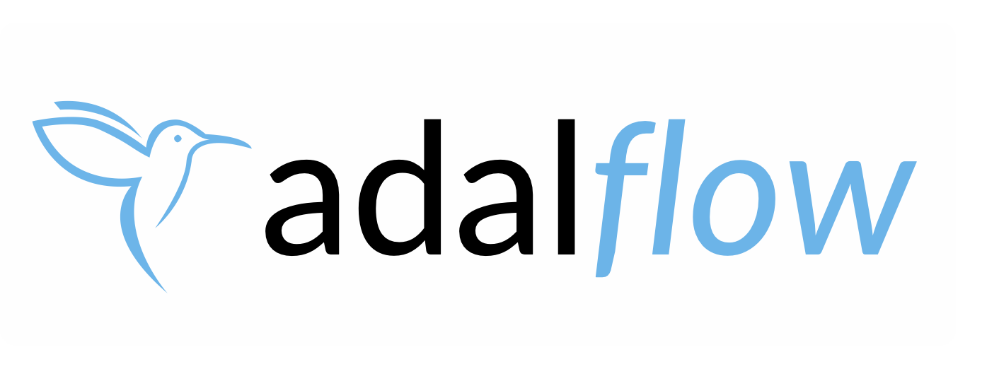
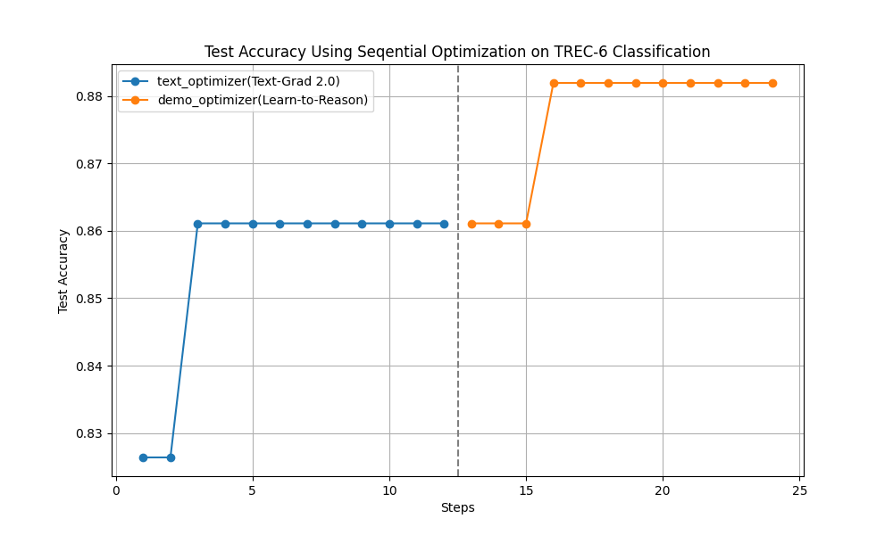
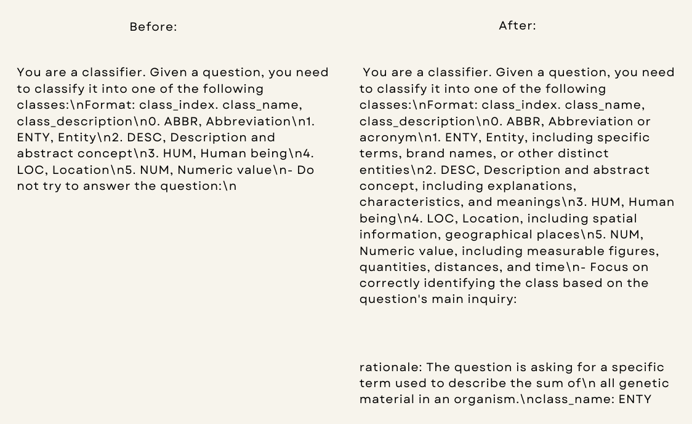

<!-- <h4 align="center">
    
</h4> -->


<h4 align="center">
    
</h4>

<h2>
    <p align="center">
     ⚡ The Library to Build and Auto-optimize LLM Applications ⚡
    </p>
</h2>


<p align="center">
    <a href="https://colab.research.google.com/drive/1TKw_JHE42Z_AWo8UuRYZCO2iuMgyslTZ?usp=sharing">
        
    </a>
</p>

<h4 align="center">
    <p>
        <a href="https://adalflow.sylph.ai/">All Documentation</a> |
        <a href="https://adalflow.sylph.ai/apis/components/components.model_client.html">Models</a> |
        <a href="https://adalflow.sylph.ai/apis/components/components.retriever.html">Retrievers</a> |
        <a href="https://adalflow.sylph.ai/apis/components/components.agent.html">Agents</a> |
        <a href="https://adalflow.sylph.ai/tutorials/evaluation.html"> LLM evaluation</a> |
        <a href="https://adalflow.sylph.ai/use_cases/question_answering.html">Trainer & Optimizers</a>
    <p>
</h4>

<p align="center">
    <a href="https://pypi.org/project/adalflow/">
        
    </a>
    <a href="https://star-history.com/#SylphAI-Inc/AdalFlow">
        
    </a>
    <a href="https://github.com/SylphAI-Inc/AdalFlow/issues">
        
    </a>
    <a href="https://opensource.org/license/MIT">
        
    </a>
      <a href="https://discord.gg/ezzszrRZvT">
        
    </a>
</p>

<h4>
<p align="center">
For AI researchers, product teams, and software engineers who want to learn the AI way.
</p>
</h4>


<!-- <a href="https://colab.research.google.com/drive/1PPxYEBa6eu__LquGoFFJZkhYgWVYE6kh?usp=sharing">
        
    </a> -->

<!-- <a href="https://pypistats.org/packages/lightrag">

</a> -->


# Why AdalFlow

1. Embracing a design pattern similar to PyTorch, AdalFlow is powerful, light, modular, and robust.
AdalFlow provides `Model-agnostic` building blocks to build LLM task pipeline, ranging from RAG, Agents to classical NLP tasks like text classification and named entity recognition. It is easy to get high performance even with just basic manual promting.
2. AdalFlow provides a unified auto-differentiative framework for both zero-shot prompt optimization and few-shot optimization. It advances existing auto-optimization research, including ``Text-Grad`` and ``DsPy``.
Through our research, ``Text-Grad 2.0`` and ``Learn-to-Reason Few-shot In Context Learning``, AdalFlow ``Trainer`` achieves the highest accuracy while being the most token-efficient.

<!-- It advances existing auto-optimization research, including Text-Grad and DsPy. Through our research, Text-Grad 2.0, and Learn-to-Reason Few-shot In-Context Learning, AdalFlow Trainer achieves the highest accuracy while being the most token-efficient. -->

<!-- AdalFlow not only helps developers build model-agnostic LLM task pipelines with full control over prompts and output processing, but it also auto-optimizes these pipelines to achieve SOTA accuracy. -->
<!-- Embracing a design pattern similar to PyTorch, AdalFlow is powerful, light, modular, and robust. -->

Here is our optimization demonstration on a text classification task:
<!-- <p align="center">
  
</p>

<p align="center">
  
</p> -->

<p align="center" style="background-color: #f0f0f0;">
  
</p>

<p align="center" style="background-color: #f0f0f0;">
  
</p>


Among all libraries, we achieved the highest accuracy with manual prompting (starting at 82%) and the highest accuracy after optimization.

Further reading: [Optimize Classification](https://adalflow.sylph.ai/use_cases/classification.html)

## Light, Modular, and Model-agnositc Task Pipeline

LLMs are like water; AdalFlow help developers quickly shape them into any applications, from GenAI applications such as chatbots, translation, summarization, code generation, RAG, and autonomous agents to classical NLP tasks like text classification and named entity recognition.

Only two fundamental but powerful base classes: `Component` for the pipeline and `DataClass` for data interaction with LLMs.
The result is a library with bare minimum abstraction, providing developers with *maximum customizability*.

You have full control over the prompt template, the model you use, and the output parsing for your task pipeline.


<p align="center">
  
</p>


<!-- LLMs are like water; they can be shaped into anything, from GenAI applications such as chatbots, translation, summarization, code generation, and autonomous agents to classical NLP tasks like text classification and named entity recognition. They interact with the world beyond the model’s internal knowledge via retrievers, memory, and tools (function calls). Each use case is unique in its data, business logic, and user experience.

Because of this, no library can provide out-of-the-box solutions. Users must build towards their own use case. This requires the library to be modular, robust, and have a clean, readable codebase. The only code you should put into production is code you either 100% trust or are 100% clear about how to customize and iterate. -->

<!-- This is what AdalFlow is: light, modular, and robust, with a 100% readable codebase. -->


Further reading: [How We Started](https://www.linkedin.com/posts/li-yin-ai_both-ai-research-and-engineering-use-pytorch-activity-7189366364694892544-Uk1U?utm_source=share&utm_medium=member_desktop), <!-- [Introduction](https://adalflow.sylph.ai/),  -->[Design Philosophy](https://adalflow.sylph.ai/tutorials/lightrag_design_philosophy.html) and [Class hierarchy](https://adalflow.sylph.ai/tutorials/class_hierarchy.html).


<!--

**PyTorch**

```python
import torch
import torch.nn as nn

class Net(nn.Module):
   def __init__(self):
      super(Net, self).__init__()
      self.conv1 = nn.Conv2d(1, 32, 3, 1)
      self.conv2 = nn.Conv2d(32, 64, 3, 1)
      self.dropout1 = nn.Dropout2d(0.25)
      self.dropout2 = nn.Dropout2d(0.5)
      self.fc1 = nn.Linear(9216, 128)
      self.fc2 = nn.Linear(128, 10)

   def forward(self, x):
      x = self.conv1(x)
      x = self.conv2(x)
      x = self.dropout1(x)
      x = self.dropout2(x)
      x = self.fc1(x)
      return self.fc2(x)
``` -->
## Unified Framework for Auto-Optimization

AdalFlow provides token-efficient and high-performing prompt optimization within a unified framework.
To optimize your pipeline, simply define a ``Parameter`` and pass it to our ``Generator``.
Whether you need to optimize task instructions or few-shot demonstrations,
our unified framework offers an easy way to **diagnose**, **visualize**, **debug**, and **train** your pipeline.

This [Dynamic Computation Graph](https://adalflow.sylph.ai/tutorials/trace_graph.html) demonstrates how our auto-differentiation and the dynamic computation graph work.

No need to manually defined nodes and edges, AdalFlow will automatically trace the computation graph for you.

### **Trainable Task Pipeline**

Just define it as a ``Parameter`` and pass it to our ``Generator``.

<p align="center">
  
</p>

### **AdalComponent & Trainer**

``AdalComponent`` acts as the 'interpreter'  between task pipeline and the trainer, defining training and validation steps, optimizers, evaluators, loss functions, backward engine for textual gradients or tracing the demonstrations, the teacher generator.

<p align="center">
  
</p>

# Quick Install

Install AdalFlow with pip:

```bash
pip install adalflow
```

Please refer to the [full installation guide](https://adalflow.sylph.ai/get_started/installation.html) for more details.


# Documentation

AdalFlow full documentation available at [adalflow.sylph.ai](https://adalflow.sylph.ai/):
- [How We Started](https://www.linkedin.com/posts/li-yin-ai_both-ai-research-and-engineering-use-pytorch-activity-7189366364694892544-Uk1U?utm_source=share&utm_medium=member_desktop)
- [Introduction](https://adalflow.sylph.ai/)
- [Full installation guide](https://adalflow.sylph.ai/get_started/installation.html)
- [Design philosophy](https://adalflow.sylph.ai/tutorials/lightrag_design_philosophy.html)
- [Class hierarchy](https://adalflow.sylph.ai/tutorials/class_hierarchy.html)
- [Tutorials](https://adalflow.sylph.ai/tutorials/index.html)
- [Supported Models](https://adalflow.sylph.ai/apis/components/components.model_client.html)
- [Supported Retrievers](https://adalflow.sylph.ai/apis/components/components.retriever.html)
- [API reference](https://adalflow.sylph.ai/apis/index.html)


# AdalFlow: A Tribute to Ada Lovelace

AdalFlow is named in honor of [Ada Lovelace](https://en.wikipedia.org/wiki/Ada_Lovelace), the pioneering female mathematician who first recognized that machines could do more than just calculations. As a team led by female founder, we aim to inspire more women to enter the AI field.

# Contributors

[](https://github.com/SylphAI-Inc/LightRAG/graphs/contributors)

# Acknowledgements

Many existing works greatly inspired AdalFlow library! Here is a non-exhaustive list:

- 📚 [PyTorch](https://github.com/pytorch/pytorch/) for design philosophy and design pattern of ``Component``, ``Parameter``, ``Sequential``.
- 📚 [Micrograd](https://github.com/karpathy/micrograd): A tiny autograd engine for our auto-differentiative architecture.
- 📚 [Text-Grad](https://github.com/zou-group/textgrad) for the ``Textual Gradient Descent`` text optimizer.
- 📚 [DSPy](https://github.com/stanfordnlp/dspy) for inspiring the ``__{input/output}__fields`` in our ``DataClass`` and the bootstrap few-shot optimizer.
- 📚 [OPRO](https://github.com/google-deepmind/opro) for adding past text instruction along with its accuracy in the text optimizer.
- 📚 [PyTorch Lightning](https://github.com/Lightning-AI/pytorch-lightning) for the ``AdalComponent`` and ``Trainer``.

# Citation

```bibtex
@software{Yin2024AdalFlow,
  author = {Li Yin},
  title = {{AdalFlow: The Library for Large Language Model (LLM) Applications}},
  month = {7},
  year = {2024},
  doi = {10.5281/zenodo.12639531},
  url = {https://github.com/SylphAI-Inc/AdalFlow}
}
```

<!-- # Star History

[](https://star-history.com/#SylphAI-Inc/AdalFlow&Date) -->
<!--
<a href="https://trendshift.io/repositories/11559" target="_blank"></a> -->
