# AdalFlow Agent Streaming Architecture Design

> **Version**: 1.1  
> **Status**: Design Specification  
> **Target Release**: AdalFlow v2.1  
> **Authors**: AdalFlow Core Team  

## Executive Summary

This document presents a comprehensive streaming architecture for AdalFlow agents that delivers **real-time, multi-modal streaming** across the entire agent execution pipeline. Unlike existing solutions that focus purely on LLM streaming, our design provides **unified streaming events** for LLM generation, tool execution, and multi-step reasoning.

**Key Innovation**: Component-native streaming that maintains AdalFlow's architectural principles while delivering enterprise-grade streaming capabilities with **sub-100ms latency** for real-time applications.

**Impact**: Enables developers to build responsive AI applications with live feedback, progress tracking, and real-time collaboration features.

## 1. Background & Analysis

### 1.1 OpenAI Agent SDK Streaming Analysis

**Strengths:**
- **Unified Event Format**: Standardizes around OpenAI Responses API format (`TResponseStreamEvent`)
- **API Bridging**: Elegant conversion between Chat Completions and Responses API
- **Structured Event Hierarchy**: Clear progression from raw events to agent events
- **State Management**: Sophisticated handling of fragmented tool calls across chunks
- **Production Ready**: Battle-tested in high-scale applications

**Critical Limitations:**
- **Vendor Lock-in**: Tightly coupled to OpenAI's proprietary event formats
- **Complex State Tracking**: Over-engineered machinery for tool call fragment accumulation
- **Limited Extensibility**: Hard to extend beyond OpenAI's predefined event structure
- **Performance Overhead**: Multiple event transformation layers create latency
- **Model Specificity**: Doesn't generalize to other model providers effectively
- **Debugging Complexity**: State management makes troubleshooting difficult

### 1.2 AdalFlow Architecture Advantages

**Component-Centric Design:**
- **GeneratorOutput**: Unified response format across all model clients
- **Modular Components**: Clean separation between Generator, Agent, Runner, ToolManager
- **Flexible Model Support**: Not tied to specific API formats
- **Simple Tool Execution**: Function-based tools with clear input/output

**Current Gaps:**
- **Incomplete Streaming**: `astream` method not implemented in Runner
- **No Event System**: Lacks structured streaming events for multi-step execution
- **Limited State Management**: No intermediate state tracking for streaming
- **Generator Streaming**: Basic streaming exists but not integrated with agents
- **Tool Streaming**: No support for streaming tool execution (sync/async/generator functions)
- **Error Propagation**: No streaming error handling and recovery mechanisms
- **Performance Metrics**: Missing streaming performance monitoring and analytics

**Streaming Function Support Requirements:**
Based on existing Runner implementation, we need to support **4 function execution types**:
1. **Sync Functions**: `def tool_func() -> result`
2. **Async Functions**: `async def tool_func() -> result` 
3. **Sync Generators**: `def tool_func() -> Generator[item, None, result]`
4. **Async Generators**: `async def tool_func() -> AsyncGenerator[item, result]`

> **Critical Fix**: Current `_tool_execute_async` incorrectly tries to `await` async generators directly. Must use `async for` iteration as implemented in the recent fix.

## 2. Design Principles

### 2.1 Core Principles

1. **Component-Native Streaming**: Build on AdalFlow's existing component architecture without disruption
2. **Unified Response Format**: Maintain `GeneratorOutput` as the primary response type across all streaming operations
3. **Progressive Enhancement**: Stream events should enhance, not replace, existing synchronous patterns
4. **Multi-Modal Support**: Handle both text generation and tool execution streaming with consistent interfaces
5. **Backward Compatibility**: Existing non-streaming APIs remain unchanged and fully functional
<!-- 6. **Performance First**: Target **sub-100ms** end-to-end latency for streaming events -->
<!-- 7. **Error Resilience**: Graceful degradation when streaming fails, with fallback to synchronous execution -->

### 2.2 Design Philosophy

**Simplicity over Sophistication**: Unlike OpenAI's complex state management, prioritize clear, maintainable code that fits AdalFlow's minimalist philosophy. Every streaming feature should be explainable in under 5 lines of code.

**Generator-Centric**: Leverage AdalFlow's Generator as the primary streaming unit, with agents orchestrating multiple generators. This maintains the existing mental model while adding streaming capabilities.

**Event-Driven Architecture**: Stream events are **first-class citizens** that can be:
- **Filtered** by event type or metadata
- **Transformed** for custom processing
- **Aggregated** for analytics and monitoring
- **Persisted** for debugging and replay

### 2.3 Performance Targets

| Metric | Target | Rationale |
|--------|--------|----------|
| **Event Latency** | <100ms | Real-time user experience |
| **Memory Overhead** | <10MB | Efficient streaming buffer management |
| **CPU Overhead** | <5% | Minimal impact on core processing |
| **Throughput** | >1000 events/sec | High-scale application support |

## 3. Streaming Event Architecture

### 3.1 Event Type Hierarchy

```python
from typing import Union, Optional, Dict, Any, List, AsyncGenerator
from dataclasses import dataclass, field
from enum import Enum
import time
from uuid import uuid4

class StreamEventType(Enum):
    # Core generation events
    GENERATION_START = "generation_start"
    GENERATION_CHUNK = "generation_chunk" 
    GENERATION_COMPLETE = "generation_complete"
    GENERATION_ERROR = "generation_error"
    
    # Tool execution events  
    TOOL_CALL_START = "tool_call_start"
    TOOL_CALL_CHUNK = "tool_call_chunk"      # For generator functions
    TOOL_CALL_COMPLETE = "tool_call_complete" 
    TOOL_CALL_ERROR = "tool_call_error"
    
    # Agent step events
    STEP_START = "step_start"
    STEP_PLANNING = "step_planning"          # When agent is deciding next action
    STEP_EXECUTING = "step_executing"        # When executing tools
    STEP_COMPLETE = "step_complete"
    STEP_ERROR = "step_error"
    
    # Agent lifecycle events
    AGENT_START = "agent_start"
    AGENT_COMPLETE = "agent_complete"
    AGENT_ERROR = "agent_error"
    AGENT_TIMEOUT = "agent_timeout"
    
    # System events
    HEARTBEAT = "heartbeat"                  # For connection health
    METRICS = "metrics"                      # Performance data

@dataclass
class BaseStreamEvent:
    """Base class for all streaming events"""
    event_type: StreamEventType
    timestamp: float = field(default_factory=time.time)
    event_id: str = field(default_factory=lambda: str(uuid4()))
    step_id: Optional[str] = None
    agent_id: Optional[str] = None
    session_id: Optional[str] = None
    metadata: Dict[str, Any] = field(default_factory=dict)
    
    def __post_init__(self):
        """Ensure all events have required metadata"""
        if 'latency_ms' not in self.metadata:
            self.metadata['latency_ms'] = 0
        if 'source_component' not in self.metadata:
            self.metadata['source_component'] = 'unknown'

@dataclass
class GenerationStreamEvent(BaseStreamEvent):
    """Events for LLM generation streaming"""
    content: Optional[str] = None                    # Full accumulated content
    delta: Optional[str] = None                      # Incremental content chunk
    generator_output: Optional[GeneratorOutput] = None
    model_name: Optional[str] = None
    prompt_tokens: Optional[int] = None
    completion_tokens: Optional[int] = None
    
    @property
    def is_complete(self) -> bool:
        return self.event_type == StreamEventType.GENERATION_COMPLETE

@dataclass
class ToolCallStreamEvent(BaseStreamEvent):
    """Events for tool execution streaming"""
    tool_name: str
    tool_input: Optional[Dict[str, Any]] = None      # Input parameters
    tool_output: Optional[Any] = None                # Output chunk (for generators)
    function_output: Optional[FunctionOutput] = None # Final wrapped output
    execution_type: Optional[str] = None             # 'sync', 'async', 'sync_gen', 'async_gen'
    
    @property
    def is_generator_execution(self) -> bool:
        return self.execution_type in ['sync_gen', 'async_gen']

@dataclass
class StepStreamEvent(BaseStreamEvent):
    """Events for agent step execution"""
    step_number: int
    action: Optional[Function] = None                # Planned action
    observation: Optional[Any] = None                # Tool execution result
    step_output: Optional[StepOutput] = None         # Final step result
    reasoning: Optional[str] = None                  # Agent's reasoning
    
    @property
    def step_name(self) -> str:
        return f"step_{self.step_number}"

@dataclass  
class AgentStreamEvent(BaseStreamEvent):
    """High-level agent events"""
    final_output: Optional[Any] = None
    step_history: Optional[List[StepOutput]] = None
    error_message: Optional[str] = None
    total_steps: Optional[int] = None
    total_tokens: Optional[int] = None
    execution_time_ms: Optional[float] = None
    
    @property
    def is_successful(self) -> bool:
        return self.event_type == StreamEventType.AGENT_COMPLETE and not self.error_message

@dataclass
class MetricsStreamEvent(BaseStreamEvent):
    """System performance and health metrics"""
    cpu_usage: Optional[float] = None
    memory_usage: Optional[float] = None
    active_streams: Optional[int] = None
    avg_latency_ms: Optional[float] = None
    events_per_second: Optional[float] = None

# Union type for all events
AdalFlowStreamEvent = Union[
    GenerationStreamEvent,
    ToolCallStreamEvent, 
    StepStreamEvent,
    AgentStreamEvent,
    MetricsStreamEvent
]

# Event filtering utilities
class EventFilter:
    """Utility class for filtering streaming events"""
    
    @staticmethod
    def by_type(event_type: StreamEventType):
        def filter_fn(event: AdalFlowStreamEvent) -> bool:
            return event.event_type == event_type
        return filter_fn
    
    @staticmethod
    def by_step(step_id: str):
        def filter_fn(event: AdalFlowStreamEvent) -> bool:
            return event.step_id == step_id
        return filter_fn
        
    @staticmethod
    def errors_only():
        def filter_fn(event: AdalFlowStreamEvent) -> bool:
            return 'error' in event.event_type.value
        return filter_fn
```

### 3.2 Event Flow Architecture

```mermaid
flowchart TD
    subgraph "Client Application"
        APP["🖥️ User Application"]
        UI["🎨 Real-time UI Updates"]
    end
    
    subgraph "AdalFlow Streaming Core"
        subgraph "Runner Layer"
            RS["Runner.astream()"]
            ASL["Agent Step Loop"]
            EF["Event Filter & Transform"]
        end
        
        subgraph "Agent Layer"  
            AG["Agent.astream()"]
            GEN["Generator.astream()"]
            TM["ToolManager.astream()"]
        end
        
        subgraph "Execution Layer"
            MC["ModelClient.astream()"]
            subgraph "Tool Execution Types"
                SyncF["🔄 sync()"] 
                AsyncF["⚡ async()"]
                SyncG["🌊 sync_gen()"]
                AsyncG["⚡🌊 async_gen()"]
            end
        end
    end
    
    subgraph "External Services"
        OPENAI["🤖 OpenAI API"]
        TOOLS["🛠️ External Tools"]
    end
    
    %% Flow connections
    APP --> RS
    RS --> ASL
    ASL --> AG
    AG --> GEN
    AG --> TM
    
    GEN --> MC
    MC --> OPENAI
    
    TM --> SyncF
    TM --> AsyncF  
    TM --> SyncG
    TM --> AsyncG
    
    SyncF --> TOOLS
    AsyncF --> TOOLS
    SyncG --> TOOLS
    AsyncG --> TOOLS
    
    %% Event flow back
    MC -.->|GenerationStreamEvent| EF
    SyncF -.->|ToolCallStreamEvent| EF
    AsyncF -.->|ToolCallStreamEvent| EF
    SyncG -.->|ToolCallStreamEvent| EF
    AsyncG -.->|ToolCallStreamEvent| EF
    
    EF -.->|StepStreamEvent| ASL
    ASL -.->|AgentStreamEvent| RS
    RS -.->|Filtered Events| APP
    APP --> UI
    
    %% Styling
    classDef streaming fill:#e1f5fe,stroke:#0277bd,stroke-width:2px
    classDef execution fill:#f3e5f5,stroke:#7b1fa2,stroke-width:2px
    classDef external fill:#fff3e0,stroke:#ef6c00,stroke-width:2px
    
    class RS,ASL,AG,GEN,TM,EF streaming
    class MC,SyncF,AsyncF,SyncG,AsyncG execution
    class OPENAI,TOOLS external
```



### 3.3 Event Lifecycle & State Management

**Event Processing Pipeline:**

1. **Generation**: Raw events created at execution points
2. **Enrichment**: Events augmented with metadata, timestamps, IDs
3. **Filtering**: Events filtered by type, step, or custom criteria
4. **Transformation**: Events converted for specific use cases
5. **Delivery**: Events delivered to client applications

**State Management Strategy:**
- **Stateless Events**: Each event is self-contained with all necessary context
- **Session Tracking**: Events linked via `session_id` for multi-step conversations
- **Step Correlation**: Events grouped by `step_id` for debugging and analytics
- **Memory Efficiency**: Events are yielded immediately, not accumulated in memory

## 4. Implementation Design

### 4.1 Core Streaming Infrastructure

#### 4.1.1 Enhanced ModelClient Streaming

**Key Requirements:**
- Maintain GeneratorOutput as unified response format
- Support token-level streaming with accumulation
- Handle streaming errors gracefully
- Provide metadata for debugging and analytics

```python
# adalflow/components/model_client/openai_client.py

import time
from typing import AsyncGenerator, Dict, Optional
from adalflow.core.types import GeneratorOutput, ModelType

class OpenAIClient:
    async def astream(
        self, 
        api_kwargs: Dict = {}, 
        model_type: ModelType = ModelType.UNDEFINED,
        session_id: Optional[str] = None
    ) -> GeneratorOutput:
        """
        Create a streaming GeneratorOutput with async generator in data field.
        
        This method returns a GeneratorOutput where the `data` field contains
        an async generator that yields streaming chunks, similar to OpenAI's
        response API format. This aligns with the expected GeneratorOutput structure.
        
        Args:
            api_kwargs: OpenAI API parameters
            model_type: Model type for response handling
            session_id: Session identifier for tracking
            
        Returns:
            GeneratorOutput: Contains async generator in data field
            
        Raises:
            StreamingError: When streaming setup fails
        """
        start_time = time.time()
        
        async def _stream_generator():
            """Internal async generator for streaming chunks using OpenAI response types."""
            from openai.types.chat import ChatCompletionChunk
            from openai._streaming import AsyncStream
            
            try:
                # Ensure streaming is enabled
                stream_kwargs = {**api_kwargs, "stream": True, "stream_options": {"include_usage": True}}
                
                stream_response: AsyncStream[ChatCompletionChunk] = await self.async_client.chat.completions.create(**stream_kwargs)
                
                accumulated_content = ""
                chunk_count = 0
                response_id = f"chatcmpl-{session_id or 'unknown'}"
                
                # Define the exact OpenAI TResponseStreamEvent types
                from dataclasses import dataclass
                from typing import Union, Optional, Any, Dict
                
                @dataclass
                class ResponseTextDeltaEvent:
                    """OpenAI ResponseTextDeltaEvent - for delta.content"""
                    type: str = "response.text.delta"
                    response_id: str = ""
                    output_index: int = 0
                    delta: str = ""
                    metadata: Optional[Dict[str, Any]] = None
                
                @dataclass 
                class ResponseFunctionCallArgumentsDeltaEvent:
                    """OpenAI ResponseFunctionCallArgumentsDeltaEvent - for delta.tool_calls"""
                    type: str = "response.function_call_arguments.delta"
                    response_id: str = ""
                    call_id: str = ""
                    name: Optional[str] = None
                    arguments_delta: str = ""
                    metadata: Optional[Dict[str, Any]] = None
                
                @dataclass
                class ResponseRefusalDeltaEvent:
                    """OpenAI ResponseRefusalDeltaEvent - for delta.refusal"""
                    type: str = "response.refusal.delta" 
                    response_id: str = ""
                    delta: str = ""
                    metadata: Optional[Dict[str, Any]] = None
                
                @dataclass
                class ResponseCompletedEvent:
                    """OpenAI ResponseCompletedEvent - for chunk.usage"""
                    type: str = "response.completed"
                    response_id: str = ""
                    usage: Dict[str, int]
                    metadata: Optional[Dict[str, Any]] = None
                
                # Type alias for TResponseStreamEvent
                TResponseStreamEvent = Union[
                    ResponseTextDeltaEvent,
                    ResponseFunctionCallArgumentsDeltaEvent, 
                    ResponseRefusalDeltaEvent,
                    ResponseCompletedEvent
                ]
                
                accumulated_content = ""
                tool_calls_state = {}  # Track tool calls by index
                
                async for chunk in stream_response:
                    chunk_start = time.time()
                    
                    # Process chunk.choices[0].delta for different types
                    if chunk.choices and len(chunk.choices) > 0:
                        choice = chunk.choices[0]
                        delta = choice.delta
                        
                        # Handle delta.content -> ResponseTextDeltaEvent
                        if delta.content:
                            accumulated_content += delta.content
                            
                            yield ResponseTextDeltaEvent(
                                response_id=response_id,
                                output_index=0,
                                delta=delta.content,
                                metadata={
                                    "chunk_number": chunk_count,
                                    "latency_ms": (time.time() - chunk_start) * 1000,
                                    "session_id": session_id
                                }
                            )
                            chunk_count += 1
                        
                        # Handle delta.tool_calls -> ResponseFunctionCallArgumentsDeltaEvent
                        if delta.tool_calls:
                            for tool_call in delta.tool_calls:
                                call_id = tool_call.id or f"call_{tool_call.index}"
                                
                                # Track tool call state
                                if call_id not in tool_calls_state:
                                    tool_calls_state[call_id] = {
                                        "name": tool_call.function.name if tool_call.function else None,
                                        "arguments": ""
                                    }
                                
                                if tool_call.function and tool_call.function.arguments:
                                    tool_calls_state[call_id]["arguments"] += tool_call.function.arguments
                                    
                                    yield ResponseFunctionCallArgumentsDeltaEvent(
                                        response_id=response_id,
                                        call_id=call_id,
                                        name=tool_calls_state[call_id]["name"],
                                        arguments_delta=tool_call.function.arguments,
                                        metadata={
                                            "chunk_number": chunk_count,
                                            "session_id": session_id,
                                            "tool_index": tool_call.index
                                        }
                                    )
                        
                        # Handle delta.refusal -> ResponseRefusalDeltaEvent
                        if hasattr(delta, 'refusal') and delta.refusal:
                            yield ResponseRefusalDeltaEvent(
                                response_id=response_id,
                                delta=delta.refusal,
                                metadata={
                                    "chunk_number": chunk_count,
                                    "session_id": session_id
                                }
                            )
                    
                    # Handle chunk.usage -> ResponseCompletedEvent
                    if hasattr(chunk, 'usage') and chunk.usage:
                        yield ResponseCompletedEvent(
                            response_id=response_id,
                            usage={
                                "prompt_tokens": chunk.usage.prompt_tokens,
                                "completion_tokens": chunk.usage.completion_tokens,
                                "total_tokens": chunk.usage.total_tokens
                            },
                            metadata={
                                "session_id": session_id,
                                "total_chunks": chunk_count,
                                "completion_time": time.time(),
                                "accumulated_content": accumulated_content,
                                "tool_calls": tool_calls_state
                            }
                        )
                        
            except Exception as e:
                # Define OpenAI-style error event
                @dataclass
                class ResponseErrorEvent:
                    """OpenAI-style response error event"""
                    type: str = "response.error"
                    response_id: str = ""
                    error_message: str = ""
                    error_type: str = ""
                    metadata: Optional[Dict[str, Any]] = None
                
                # Yield OpenAI-style error event
                yield ResponseErrorEvent(
                    response_id=response_id,
                    error_message=str(e),
                    error_type=type(e).__name__,
                    metadata={
                        "session_id": session_id,
                        "failed_at": time.time(),
                        "model_type": model_type.value
                    }
                )
                raise
        
        # Return GeneratorOutput with async generator in data field
        return GeneratorOutput(
            data=_stream_generator(),  # The actual async generator
            raw_response=None,  # Will be populated as streaming progresses
            metadata={
                "streaming": True,
                "stream_start_time": start_time,
                "model_type": model_type.value,
                "session_id": session_id,
                "api_kwargs": api_kwargs
            }
        )
    
    def _parse_streaming_chunk(self, chunk) -> tuple[Optional[str], Optional[dict]]:
        """Parse OpenAI streaming chunk for content and usage data."""
        delta_content = None
        usage_data = None
        
        if hasattr(chunk, 'choices') and chunk.choices:
            delta = chunk.choices[0].delta
            if hasattr(delta, 'content') and delta.content:
                delta_content = delta.content
        
        if hasattr(chunk, 'usage') and chunk.usage:
            usage_data = {
                'prompt_tokens': chunk.usage.prompt_tokens,
                'completion_tokens': chunk.usage.completion_tokens,
                'total_tokens': chunk.usage.total_tokens
            }
        
        return delta_content, usage_data
```

#### 4.1.2 Multi-Provider Support

**Extend to other model providers:**

```python
# Abstract base for streaming model clients
from abc import ABC, abstractmethod

class StreamingModelClient(ABC):
    @abstractmethod
    async def astream(
        self, 
        api_kwargs: Dict = {}, 
        model_type: ModelType = ModelType.UNDEFINED
    ) -> AsyncGenerator[GeneratorOutput, None]:
        """Stream responses from model provider."""
        pass

# Anthropic streaming support
class AnthropicClient(StreamingModelClient):
    async def astream(self, api_kwargs: Dict = {}, model_type: ModelType = ModelType.UNDEFINED):
        # Anthropic-specific streaming implementation
        pass

# Azure OpenAI streaming support  
class AzureOpenAIClient(StreamingModelClient):
    async def astream(self, api_kwargs: Dict = {}, model_type: ModelType = ModelType.UNDEFINED):
        # Azure-specific streaming implementation
        pass
```

### 4.2 Generator Streaming Enhancement

**Extend Generator with event-wrapped streaming:**

```python
# adalflow/core/generator.py

import time
from typing import AsyncGenerator, Dict, Optional
from adalflow.core.streaming import GenerationStreamEvent, StreamEventType

class Generator:
    async def astream(
        self, 
        prompt_kwargs: Optional[Dict] = None,
        model_kwargs: Optional[Dict] = None,
        **kwargs
    ) -> AsyncGenerator[GenerationStreamEvent, None]:
        """
        Stream generator responses with comprehensive event wrapping.
        
        Args:
            prompt_kwargs: Parameters for prompt formatting
            model_kwargs: Parameters for model execution
            **kwargs: Additional parameters
            
        Yields:
            GenerationStreamEvent: Wrapped streaming events with metadata
        """
        session_id = kwargs.get('session_id', str(uuid4()))
        
        # Start generation event
        yield GenerationStreamEvent(
            event_type=StreamEventType.GENERATION_START,
            session_id=session_id,
            metadata={
                "prompt_kwargs": prompt_kwargs,
                "model_kwargs": model_kwargs,
                "source_component": "Generator"
            }
        )
        
        try:
            # Prepare model inputs
            composed_kwargs = self._compose_model_kwargs(**model_kwargs or {})
            api_kwargs = self.model_client.convert_inputs_to_api_kwargs(
                input=self._prepare_input(prompt_kwargs or {}),
                model_kwargs=composed_kwargs
            )
            
            accumulated_content = ""
            
            # Get streaming GeneratorOutput (contains async generator in data field)
            streaming_generator_output = await self.model_client.astream(
                api_kwargs, 
                session_id=session_id
            )
            
            # Extract the async generator from the data field
            stream_data = streaming_generator_output.data
            accumulated_content = ""
            final_generator_output = None
            
            # Only handle TResponseStreamEvent types from OpenAI
            accumulated_content = ""
            tool_calls_data = {}
            final_generator_output = None
            
            async for openai_event in stream_data:
                # Handle only the specific TResponseStreamEvent types
                if hasattr(openai_event, 'type'):
                    
                    if openai_event.type == "response.text.delta":
                        # ResponseTextDeltaEvent - delta.content
                        delta_content = openai_event.delta
                        accumulated_content += delta_content
                        
                        yield GenerationStreamEvent(
                            event_type=StreamEventType.GENERATION_CHUNK,
                            session_id=session_id,
                            delta=delta_content,
                            accumulated_content=accumulated_content,
                            metadata={
                                "source_component": "Generator",
                                "response_id": openai_event.response_id,
                                "output_index": openai_event.output_index,
                                **openai_event.metadata
                            }
                        )
                        
                    elif openai_event.type == "response.function_call_arguments.delta":
                        # ResponseFunctionCallArgumentsDeltaEvent - delta.tool_calls
                        call_id = openai_event.call_id
                        
                        # Track tool call arguments
                        if call_id not in tool_calls_data:
                            tool_calls_data[call_id] = {
                                "name": openai_event.name,
                                "arguments": ""
                            }
                        tool_calls_data[call_id]["arguments"] += openai_event.arguments_delta
                        
                        yield GenerationStreamEvent(
                            event_type=StreamEventType.TOOL_CALL_CHUNK,
                            session_id=session_id,
                            delta=openai_event.arguments_delta,
                            metadata={
                                "source_component": "Generator",
                                "call_id": call_id,
                                "function_name": openai_event.name,
                                "accumulated_args": tool_calls_data[call_id]["arguments"],
                                **openai_event.metadata
                            }
                        )
                        
                    elif openai_event.type == "response.refusal.delta":
                        # ResponseRefusalDeltaEvent - delta.refusal
                        yield GenerationStreamEvent(
                            event_type=StreamEventType.GENERATION_ERROR,
                            session_id=session_id,
                            delta=openai_event.delta,
                            metadata={
                                "source_component": "Generator",
                                "error_type": "refusal",
                                "response_id": openai_event.response_id,
                                **openai_event.metadata
                            }
                        )
                        
                    elif openai_event.type == "response.completed":
                        # ResponseCompletedEvent - chunk.usage
                        usage_data = openai_event.usage
                        
                        # Get final content from metadata
                        final_content = openai_event.metadata.get("accumulated_content", accumulated_content)
                        
                        final_generator_output = GeneratorOutput(
                            data=final_content,
                            raw_response=streaming_generator_output.raw_response,
                            metadata={
                                **streaming_generator_output.metadata,
                                "usage": usage_data,
                                "response_id": openai_event.response_id,
                                "tool_calls": openai_event.metadata.get("tool_calls", tool_calls_data)
                            }
                        )
                        
                        # Apply output processors if configured
                        if self.output_processors and final_generator_output:
                            final_generator_output = self._apply_output_processors(final_generator_output)
                        
                        yield GenerationStreamEvent(
                            event_type=StreamEventType.GENERATION_COMPLETE,
                            session_id=session_id,
                            accumulated_content=final_content,
                            generator_output=final_generator_output,
                            metadata={
                                "source_component": "Generator",
                                "success": True,
                                "response_id": openai_event.response_id,
                                "usage": usage_data,
                                "tool_calls": tool_calls_data
                            }
                        )
            
        except Exception as e:
            # Error event
            yield GenerationStreamEvent(
                event_type=StreamEventType.GENERATION_ERROR,
                session_id=session_id,
                metadata={
                    "source_component": "Generator",
                    "error": str(e),
                    "error_type": type(e).__name__
                }
            )
            raise
```

### 4.3 Tool Streaming Support

**Critical Implementation**: Support all 4 function execution types with streaming:

```python
# adalflow/core/tool_manager.py

import inspect
import time
from typing import AsyncGenerator, Union, Any
from adalflow.core.streaming import ToolCallStreamEvent, StreamEventType
from adalflow.core.func_tool import FunctionOutput

class ToolManager:
    async def astream_tool_execution(
        self,
        func: Function,
        session_id: Optional[str] = None
    ) -> AsyncGenerator[ToolCallStreamEvent, None]:
        """
        Stream tool execution supporting all 4 function types:
        1. sync: def func() -> result  
        2. async: async def func() -> result
        3. sync_gen: def func() -> Generator[item, None, result]
        4. async_gen: async def func() -> AsyncGenerator[item, result]
        
        Critical Fix: Use 'async for' for async generators, not 'await'
        
        Yields:
            ToolCallStreamEvent: Streaming tool execution events
        """
        execution_start = time.time()
        
        # Determine execution type
        tool_func = self._get_function(func.name)
        execution_type = self._determine_execution_type(tool_func)
        
        # Emit start event
        yield ToolCallStreamEvent(
            event_type=StreamEventType.TOOL_CALL_START,
            session_id=session_id,
            tool_name=func.name,
            tool_input=func.kwargs,
            execution_type=execution_type,
            metadata={
                "source_component": "ToolManager",
                "function_signature": str(inspect.signature(tool_func))
            }
        )
        
        try:
            # Execute function using existing logic
            result = self(expr_or_fun=func, step="execute")
            
            # Handle different execution types
            if execution_type == "sync":
                # Synchronous function - result is already available
                final_result = result
                
            elif execution_type == "async":
                # Async function - await the coroutine  
                final_result = await result
                
            elif execution_type == "sync_gen":
                # Sync generator - iterate and stream chunks
                collected_results = []
                for item in result:  # Use regular 'for' for sync generators
                    collected_results.append(item)
                    
                    # Emit chunk event
                    yield ToolCallStreamEvent(
                        event_type=StreamEventType.TOOL_CALL_CHUNK,
                        session_id=session_id,
                        tool_name=func.name,
                        tool_output=item,
                        execution_type=execution_type,
                        metadata={
                            "source_component": "ToolManager",
                            "chunk_number": len(collected_results)
                        }
                    )
                
                final_result = collected_results[-1] if collected_results else None
                
            elif execution_type == "async_gen":
                # Async generator - use 'async for' NOT 'await'
                collected_results = []
                async for item in result:  # CRITICAL: async for, not await
                    collected_results.append(item)
                    
                    # Emit chunk event
                    yield ToolCallStreamEvent(
                        event_type=StreamEventType.TOOL_CALL_CHUNK,
                        session_id=session_id,
                        tool_name=func.name,
                        tool_output=item,
                        execution_type=execution_type,
                        metadata={
                            "source_component": "ToolManager",
                            "chunk_number": len(collected_results)
                        }
                    )
                
                final_result = collected_results[-1] if collected_results else None
            
            else:
                raise ValueError(f"Unknown execution type: {execution_type}")
            
            # Create FunctionOutput wrapper
            function_output = FunctionOutput(
                name=func.name,
                input=func,
                output=final_result
            )
            
            # Emit completion event
            yield ToolCallStreamEvent(
                event_type=StreamEventType.TOOL_CALL_COMPLETE,
                session_id=session_id,
                tool_name=func.name,
                tool_output=final_result,
                function_output=function_output,
                execution_type=execution_type,
                metadata={
                    "source_component": "ToolManager",
                    "execution_time_ms": (time.time() - execution_start) * 1000,
                    "success": True
                }
            )
            
        except Exception as e:
            # Emit error event
            yield ToolCallStreamEvent(
                event_type=StreamEventType.TOOL_CALL_ERROR,
                session_id=session_id,
                tool_name=func.name,
                execution_type=execution_type,
                metadata={
                    "source_component": "ToolManager",
                    "error": str(e),
                    "error_type": type(e).__name__,
                    "execution_time_ms": (time.time() - execution_start) * 1000
                }
            )
            raise
    
    def _determine_execution_type(self, func) -> str:
        """Determine function execution type for proper streaming handling."""
        if inspect.iscoroutinefunction(func):
            return "async"
        elif inspect.isgeneratorfunction(func):
            return "sync_gen"
        elif inspect.isasyncgenfunction(func):
            return "async_gen"
        else:
            return "sync"
```

### 4.4 Runner Orchestration - Complete Implementation

**The crown jewel**: Complete `Runner.astream()` implementation:

```python
# adalflow/core/runner.py

import time
from typing import AsyncGenerator, Optional, Any
from adalflow.core.streaming import (
    AdalFlowStreamEvent, 
    StepStreamEvent, 
    AgentStreamEvent, 
    StreamEventType
)
from adalflow.core.types import StepOutput

class Runner:
    async def astream(
        self,
        user_query: str,
        current_objective: Optional[str] = None,
        memory: Optional[str] = None,
        session_id: Optional[str] = None
    ) -> AsyncGenerator[AdalFlowStreamEvent, None]:
        """
        Complete streaming orchestration for multi-step agent execution.
        
        This method streams ALL events across the entire agent pipeline:
        - Agent lifecycle events (start/complete/error)
        - Step execution events (planning/executing/complete)
        - Generation events (LLM streaming)
        - Tool execution events (all 4 function types)
        
        Args:
            user_query: Initial user question/request
            current_objective: Current objective context
            memory: Previous conversation memory
            session_id: Session identifier for tracking
            
        Yields:
            AdalFlowStreamEvent: All streaming events during execution
        """
        execution_start = time.time()
        session_id = session_id or str(uuid4())
        
        # Emit agent start event
        yield AgentStreamEvent(
            event_type=StreamEventType.AGENT_START,
            session_id=session_id,
            metadata={
                "source_component": "Runner",
                "user_query": user_query,
                "max_steps": self.max_steps
            }
        )
        
        try:
            # Prepare initial prompt context
            prompt_kwargs = {
                "user_query": user_query,
                "current_objective": current_objective,
                "memory": memory,
                "step_history": self.step_history,
            }
            
            step_count = 1
            last_output = None
            
            # Multi-step execution loop
            while step_count <= self.max_steps:
                step_id = f"step_{step_count}"
                step_start = time.time()
                
                # Emit step start event
                yield StepStreamEvent(
                    event_type=StreamEventType.STEP_START,
                    session_id=session_id,
                    step_id=step_id,
                    step_number=step_count,
                    metadata={
                        "source_component": "Runner",
                        "step_context": "planning"
                    }
                )
                
                try:
                    # Planning Phase: Stream LLM generation
                    yield StepStreamEvent(
                        event_type=StreamEventType.STEP_PLANNING,
                        session_id=session_id,
                        step_id=step_id,
                        step_number=step_count,
                        metadata={"source_component": "Runner", "phase": "planning"}
                    )
                    
                    final_generator_output = None
                    async for generation_event in self.agent.planner.astream(
                        prompt_kwargs=prompt_kwargs,
                        session_id=session_id
                    ):
                        # Enrich and forward generation events
                        generation_event.step_id = step_id
                        generation_event.agent_id = self.agent.id if hasattr(self.agent, 'id') else None
                        yield generation_event
                        
                        if generation_event.event_type == StreamEventType.GENERATION_COMPLETE:
                            final_generator_output = generation_event.generator_output
                    
                    # Parse planned action from LLM output
                    function = self._get_planner_function(final_generator_output)
                    
                    # Execution Phase: Stream tool execution
                    yield StepStreamEvent(
                        event_type=StreamEventType.STEP_EXECUTING,
                        session_id=session_id,
                        step_id=step_id,
                        step_number=step_count,
                        action=function,
                        metadata={"source_component": "Runner", "phase": "execution"}
                    )
                    
                    final_function_output = None
                    async for tool_event in self.agent.tool_manager.astream_tool_execution(
                        function, session_id=session_id
                    ):
                        # Enrich and forward tool events
                        tool_event.step_id = step_id
                        tool_event.agent_id = self.agent.id if hasattr(self.agent, 'id') else None
                        yield tool_event
                        
                        if tool_event.event_type == StreamEventType.TOOL_CALL_COMPLETE:
                            final_function_output = tool_event.function_output
                    
                    # Create step output record
                    step_output = StepOutput(
                        step=step_count,
                        action=function,
                        function=function,
                        observation=final_function_output.output if final_function_output else None,
                    )
                    self.step_history.append(step_output)
                    
                    # Emit step completion event
                    yield StepStreamEvent(
                        event_type=StreamEventType.STEP_COMPLETE,
                        session_id=session_id,
                        step_id=step_id,
                        step_number=step_count,
                        action=function,
                        observation=final_function_output.output if final_function_output else None,
                        step_output=step_output,
                        metadata={
                            "source_component": "Runner",
                            "step_duration_ms": (time.time() - step_start) * 1000,
                            "success": True
                        }
                    )
                    
                    # Check termination condition
                    if self._check_last_step(function):
                        last_output = self._process_data(
                            final_function_output.output if final_function_output else None
                        )
                        break
                        
                    # Update context for next iteration
                    prompt_kwargs["step_history"] = self.step_history
                    step_count += 1
                    
                except Exception as step_error:
                    # Emit step error event
                    yield StepStreamEvent(
                        event_type=StreamEventType.STEP_ERROR,
                        session_id=session_id,
                        step_id=step_id,
                        step_number=step_count,
                        metadata={
                            "source_component": "Runner",
                            "error": str(step_error),
                            "error_type": type(step_error).__name__,
                            "step_duration_ms": (time.time() - step_start) * 1000
                        }
                    )
                    raise step_error
            
            # Emit successful completion event
            yield AgentStreamEvent(
                event_type=StreamEventType.AGENT_COMPLETE,
                session_id=session_id,
                final_output=last_output,
                step_history=self.step_history,
                total_steps=len(self.step_history),
                execution_time_ms=(time.time() - execution_start) * 1000,
                metadata={
                    "source_component": "Runner",
                    "success": True,
                    "completed_in_steps": len(self.step_history)
                }
            )
            
        except Exception as e:
            # Emit agent error event
            yield AgentStreamEvent(
                event_type=StreamEventType.AGENT_ERROR,
                session_id=session_id,
                error_message=f"Agent execution failed: {str(e)}",
                step_history=self.step_history,
                total_steps=len(self.step_history),
                execution_time_ms=(time.time() - execution_start) * 1000,
                metadata={
                    "source_component": "Runner",
                    "error_type": type(e).__name__,
                    "failed_at_step": len(self.step_history) + 1
                }
            )
        
    except Exception as e:
        # Emit error event
        yield ToolCallStreamEvent(
            event_type=StreamEventType.TOOL_CALL_COMPLETE,
            timestamp=time.time(),
            tool_name=func.name,
            metadata={"error": str(e)}
        )

## 🚀 Usage Examples

**Important Note on TResponseStreamEvent Architecture:**
The streaming architecture now strictly uses OpenAI's **TResponseStreamEvent** types for complete compatibility. Both the model client and runner only handle these specific types in the `data` field.

### TResponseStreamEvent Types Only:
- **ResponseTextDeltaEvent** (delta.content) - Text streaming chunks
- **ResponseFunctionCallArgumentsDeltaEvent** (delta.tool_calls) - Tool call arguments (accumulated)
- **ResponseRefusalDeltaEvent** (delta.refusal) - Model refusals  
- **ResponseCompletedEvent** (chunk.usage) - Final completion with usage data

**Strict Type Enforcement:**
- `OpenAIClient.astream()` generates **only** these TResponseStreamEvent types in `GeneratorOutput.data`
- `Generator.astream()` processes **only** these TResponseStreamEvent types
- `Runner.astream()` handles **only** these TResponseStreamEvent types
- **No other event types** - complete OpenAI API compatibility

The streaming architecture supports various integration patterns:

### 5.1 Basic Agent Streaming

```python
import asyncio
from adalflow.core import Agent, Runner
from adalflow.components.model_client import OpenAIClient
from adalflow.core.streaming import (
    GenerationStreamEvent, 
    ToolCallStreamEvent, 
    StepStreamEvent,
    AgentStreamEvent,
    StreamEventType
)

async def strict_tresponse_streaming_example():
    """Example showing strict TResponseStreamEvent type handling."""
    
    # Setup OpenAI client that generates only TResponseStreamEvent types
    openai_client = OpenAIClient()
    
    # Stream from model client - only TResponseStreamEvent types in data field
    generator_output = await openai_client.astream(
        api_kwargs={"model": "gpt-4", "messages": [{"role": "user", "content": "Hello"}]}
    )
    
    # Process only the 4 allowed TResponseStreamEvent types
    async for tresponse_event in generator_output.data:
        if tresponse_event.type == "response.text.delta":
            # Handle ResponseTextDeltaEvent (delta.content)
            print(f"Text delta: {tresponse_event.delta}")
            
        elif tresponse_event.type == "response.function_call_arguments.delta":
            # Handle ResponseFunctionCallArgumentsDeltaEvent (delta.tool_calls)
            print(f"Tool call args: {tresponse_event.arguments_delta}")
            
        elif tresponse_event.type == "response.refusal.delta":
            # Handle ResponseRefusalDeltaEvent (delta.refusal)
            print(f"Refusal: {tresponse_event.delta}")
            
        elif tresponse_event.type == "response.completed":
            # Handle ResponseCompletedEvent (chunk.usage)
            print(f"Completed with usage: {tresponse_event.usage}")
            
        # No other types are processed - strict enforcement

async def basic_streaming_example():
    """Basic real-time agent streaming with TResponseStreamEvent handling."""
    
    # Setup agent with streaming-enabled components
    agent = Agent(
        name="research_agent",
        model_client=OpenAIClient(),
        model_kwargs={"model": "gpt-4", "stream": True},
        tools=[web_search_tool, calculator_tool]
    )
    
    runner = Runner(agent=agent, max_steps=5)
    
    # Stream complete agent execution
    async for event in runner.astream(
        user_query="What's the population of Tokyo and how does it compare to New York?",
        session_id="demo_session_001"
    ):
        # Real-time event processing
        print(f"[{event.event_type.value}] {event.timestamp:.3f}")
        
        if isinstance(event, GenerationStreamEvent):
            # Stream LLM generation chunks
            if event.event_type == StreamEventType.GENERATION_CHUNK:
                print(f"   LLM: {event.delta}", end="", flush=True)
            elif event.event_type == StreamEventType.GENERATION_COMPLETE:
                print(f"\n   ✓ Generation complete")
                
        elif isinstance(event, ToolCallStreamEvent):
            # Stream tool execution
            if event.event_type == StreamEventType.TOOL_CALL_START:
                print(f"   🔧 Executing tool: {event.tool_name}")
            elif event.event_type == StreamEventType.TOOL_CALL_CHUNK:
                print(f"   📊 Tool chunk: {event.tool_output}")
            elif event.event_type == StreamEventType.TOOL_CALL_COMPLETE:
                print(f"   ✅ Tool complete: {event.tool_name}")
                
        elif isinstance(event, StepStreamEvent):
            # Stream step execution
            if event.event_type == StreamEventType.STEP_START:
                print(f"\n🚀 Step {event.step_number} starting...")
            elif event.event_type == StreamEventType.STEP_COMPLETE:
                print(f"✅ Step {event.step_number} completed")
                
        elif isinstance(event, AgentStreamEvent):
            # Stream agent lifecycle
            if event.event_type == StreamEventType.AGENT_START:
                print(f"🤖 Agent starting execution...")
            elif event.event_type == StreamEventType.AGENT_COMPLETE:
                print(f"🎉 Agent completed! Final result: {event.final_output}")
                print(f"   Total steps: {event.total_steps}")
                print(f"   Execution time: {event.execution_time_ms:.2f}ms")

# Run the example
asyncio.run(basic_streaming_example())
```

### 5.2 Event Filtering and Processing

```python
import asyncio
from adalflow.core.streaming import filter_events_by_type, StreamEventType

async def filtered_streaming_example():
    """Demonstrate event filtering for specific use cases."""
    
    runner = Runner(agent=agent)
    event_stream = runner.astream(user_query="Analyze climate data for 2023")
    
    # Filter only generation events
    generation_events = filter_events_by_type(
        event_stream, 
        [StreamEventType.GENERATION_CHUNK, StreamEventType.GENERATION_COMPLETE]
    )
    
    print("=== LLM Generation Stream ===")
    async for event in generation_events:
        if event.event_type == StreamEventType.GENERATION_CHUNK:
            print(event.delta, end="", flush=True)
        elif event.event_type == StreamEventType.GENERATION_COMPLETE:
            print("\n[Generation Complete]")
            
    # Or filter only tool execution events
    tool_events = filter_events_by_type(
        runner.astream(user_query="Calculate compound interest"),
        [StreamEventType.TOOL_CALL_START, StreamEventType.TOOL_CALL_COMPLETE]
    )
    
    print("\n=== Tool Execution Stream ===")
    async for event in tool_events:
        if event.event_type == StreamEventType.TOOL_CALL_START:
            print(f"🔧 Starting: {event.tool_name}({event.tool_input})")
        elif event.event_type == StreamEventType.TOOL_CALL_COMPLETE:
            print(f"✅ Completed: {event.tool_name} -> {event.tool_output}")
```

### 5.3 Multi-Modal Streaming with Custom Tools

```python
import asyncio
from typing import AsyncGenerator

# Custom streaming tool examples
def data_processing_sync_gen(data: list) -> Generator[dict, None, dict]:
    """Sync generator tool - processes data chunks."""
    results = []
    for i, item in enumerate(data):
        processed = {"item": item, "processed_at": i}
        results.append(processed)
        yield processed  # Stream each processed item
    return {"total_processed": len(results), "results": results}

async def async_data_fetch(url: str) -> AsyncGenerator[dict, dict]:
    """Async generator tool - fetches data with progress updates."""
    import aiohttp
    async with aiohttp.ClientSession() as session:
        async with session.get(url) as response:
            content_length = int(response.headers.get('content-length', 0))
            downloaded = 0
            
            async for chunk in response.content.iter_chunked(1024):
                downloaded += len(chunk)
                progress = (downloaded / content_length) * 100 if content_length else 0
                
                # Yield progress updates
                yield {
                    "type": "progress",
                    "downloaded": downloaded,
                    "total": content_length,
                    "percent": progress
                }
            
            # Return final result
            return {"status": "complete", "size": downloaded}

async def multi_modal_streaming_example():
    """Demonstrate streaming with all 4 function types."""
    
    # Register diverse tools
    tools = [
        sync_calculator,                    # sync function
        async_web_search,                   # async function  
        data_processing_sync_gen,           # sync generator
        async_data_fetch                    # async generator
    ]
    
    agent = Agent(name="multi_modal_agent", tools=tools)
    runner = Runner(agent=agent)
    
    async for event in runner.astream(
        user_query="Process dataset from https://api.example.com/data and calculate statistics"
    ):
        if isinstance(event, ToolCallStreamEvent):
            if event.execution_type == "sync_gen":
                print(f"📊 Sync Gen Chunk: {event.tool_output}")
            elif event.execution_type == "async_gen":
                print(f"🌐 Async Gen Progress: {event.tool_output}")
            elif event.execution_type == "async":
                print(f"⚡ Async Tool: {event.tool_name}")
            elif event.execution_type == "sync":
                print(f"🔢 Sync Tool: {event.tool_name}")

asyncio.run(multi_modal_streaming_example())
```

### 5.4 Real-time Web Interface Integration

```python
from fastapi import FastAPI, WebSocket
import json

app = FastAPI()

@app.websocket("/agent/stream")
async def websocket_agent_streaming(websocket: WebSocket):
    """WebSocket endpoint for real-time agent streaming."""
    await websocket.accept()
    
    try:
        # Receive user query
        data = await websocket.receive_text()
        query_data = json.loads(data)
        user_query = query_data["query"]
        
        # Setup agent and runner
        runner = Runner(agent=create_agent())
        
        # Stream events to client in real-time
        async for event in runner.astream(user_query=user_query):
            # Convert event to JSON for web client
            event_data = {
                "type": event.event_type.value,
                "timestamp": event.timestamp,
                "session_id": getattr(event, 'session_id', None)
            }
            
            # Add type-specific data
            if isinstance(event, GenerationStreamEvent):
                event_data.update({
                    "delta": event.delta,
                    "accumulated_content": event.accumulated_content
                })
            elif isinstance(event, ToolCallStreamEvent):
                event_data.update({
                    "tool_name": event.tool_name,
                    "tool_output": event.tool_output,
                    "execution_type": event.execution_type
                })
            elif isinstance(event, AgentStreamEvent):
                event_data.update({
                    "final_output": event.final_output,
                    "total_steps": event.total_steps
                })
            
            # Send event to web client
            await websocket.send_text(json.dumps(event_data))
            
    except Exception as e:
        await websocket.send_text(json.dumps({
            "type": "error",
            "message": str(e)
        }))
    finally:
        await websocket.close()
```

## 6. Performance Considerations

### 6.1 Latency Optimization

**Target Performance Metrics:**
- **First Token Latency**: < 100ms from request to first generation chunk
- **Tool Execution Latency**: < 50ms overhead for streaming wrapper
- **Event Emission Latency**: < 10ms per event
- **Memory Overhead**: < 5% increase vs non-streaming execution

**Implementation Strategies:**

```python
# Optimize event creation with object pooling
class EventPool:
    def __init__(self):
        self._generation_events = []
        self._tool_events = []
    
    def get_generation_event(self) -> GenerationStreamEvent:
        if self._generation_events:
            return self._generation_events.pop()
        return GenerationStreamEvent()
    
    def return_generation_event(self, event: GenerationStreamEvent):
        event.reset()  # Clear data
        self._generation_events.append(event)

# Use asyncio.create_task for concurrent streaming
async def optimized_streaming():
    # Stream generation and tool execution concurrently when possible
    generation_task = asyncio.create_task(stream_generation())
    tool_task = asyncio.create_task(stream_tools())
    
    async for event in asyncio.as_completed([generation_task, tool_task]):
        yield event
```

### 6.2 Memory Management

```python
# Implement backpressure for large streams
class BackpressureStreamManager:
    def __init__(self, max_buffer_size: int = 1000):
        self.max_buffer_size = max_buffer_size
        self.buffer = asyncio.Queue(maxsize=max_buffer_size)
    
    async def emit_event(self, event: AdalFlowStreamEvent):
        # Apply backpressure if buffer is full
        if self.buffer.full():
            # Drop oldest events or wait
            await self.buffer.get()
        await self.buffer.put(event)
    
    async def stream_events(self):
        while True:
            event = await self.buffer.get()
            yield event
```

### 6.3 Error Recovery and Resilience

```python
async def resilient_streaming(runner: Runner, user_query: str):
    """Implement error recovery with partial results."""
    max_retries = 3
    retry_count = 0
    
    while retry_count < max_retries:
        try:
            async for event in runner.astream(user_query=user_query):
                yield event
            break  # Success
        except Exception as e:
            retry_count += 1
            if retry_count >= max_retries:
                # Emit final error event
                yield AgentStreamEvent(
                    event_type=StreamEventType.AGENT_ERROR,
                    error_message=f"Failed after {max_retries} retries: {str(e)}"
                )
                break
            
            # Exponential backoff
            await asyncio.sleep(2 ** retry_count)
```

## 7. Testing Strategy

### 7.1 Unit Testing

```python
import pytest
from unittest.mock import AsyncMock

@pytest.mark.asyncio
async def test_generation_streaming():
    """Test Generator.astream() emits correct events."""
    # Mock model client
    mock_client = AsyncMock()
    mock_client.astream.return_value = async_generator_mock([
        GeneratorOutput(data="Hello"),
        GeneratorOutput(data=" World")
    ])
    
    generator = Generator(model_client=mock_client)
    events = []
    
    async for event in generator.astream():
        events.append(event)
    
    # Verify event sequence
    assert len(events) == 4  # start, chunk, chunk, complete
    assert events[0].event_type == StreamEventType.GENERATION_START
    assert events[1].event_type == StreamEventType.GENERATION_CHUNK
    assert events[1].delta == "Hello"
    assert events[3].event_type == StreamEventType.GENERATION_COMPLETE

@pytest.mark.asyncio 
async def test_tool_streaming_all_types():
    """Test ToolManager handles all 4 function types correctly."""
    tool_manager = ToolManager()
    
    # Test async generator tool
    async def async_gen_tool():
        yield "chunk1"
        yield "chunk2"
        return "final"
    
    func = Function(name="async_gen_tool", func=async_gen_tool)
    events = []
    
    async for event in tool_manager.astream_tool_execution(func):
        events.append(event)
    
    # Verify async generator streaming
    chunk_events = [e for e in events if e.event_type == StreamEventType.TOOL_CALL_CHUNK]
    assert len(chunk_events) == 2
    assert chunk_events[0].tool_output == "chunk1"
    assert chunk_events[1].tool_output == "chunk2"
```

### 7.2 Integration Testing

```python
@pytest.mark.asyncio
async def test_end_to_end_streaming():
    """Test complete agent streaming pipeline."""
    agent = Agent(name="test_agent", tools=[calculator_tool])
    runner = Runner(agent=agent, max_steps=2)
    
    events = []
    async for event in runner.astream(user_query="Calculate 2+2"):
        events.append(event)
    
    # Verify complete event flow
    event_types = [e.event_type for e in events]
    assert StreamEventType.AGENT_START in event_types
    assert StreamEventType.GENERATION_CHUNK in event_types
    assert StreamEventType.TOOL_CALL_COMPLETE in event_types
    assert StreamEventType.AGENT_COMPLETE in event_types

@pytest.mark.performance
async def test_streaming_performance():
    """Test streaming meets performance targets."""
    import time
    
    runner = Runner(agent=create_test_agent())
    
    start_time = time.time()
    first_event_time = None
    
    async for event in runner.astream(user_query="Simple calculation"):
        if first_event_time is None:
            first_event_time = time.time()
        
        if event.event_type == StreamEventType.AGENT_COMPLETE:
            break
    
    # Assert performance targets 
    first_token_latency = (first_event_time - start_time) * 1000
    assert first_token_latency < 100, f"First token latency {first_token_latency}ms exceeds 100ms target"
```

## 8. Migration and Rollout

### 8.1 Backward Compatibility

- **Existing APIs unchanged**: All current `call()` and `acall()` methods remain functional
- **Opt-in streaming**: Streaming is only activated when `astream()` methods are called
- **Gradual adoption**: Teams can migrate component by component
- **Fallback support**: Non-streaming execution paths remain as primary

### 8.2 Rollout Phases

**Phase 1: Core Infrastructure (Week 1-2)**
- Implement streaming event architecture
- Add `ModelClient.astream()` for OpenAI
- Basic `Generator.astream()` support

**Phase 2: Tool Streaming (Week 3-4)** 
- Complete `ToolManager.astream_tool_execution()`
- Support all 4 function execution types
- Comprehensive error handling

**Phase 3: Agent Orchestration (Week 5-6)**
- Implement `Runner.astream()`
- Multi-step streaming coordination
- Performance optimization

**Phase 4: Advanced Features (Week 7-8)**
- Multi-provider model client support
- Advanced event filtering and processing
- Monitoring and observability integration

### 8.3 Success Metrics

- **Adoption Rate**: 25% of projects using streaming within 3 months
- **Performance**: Sub-100ms first token latency in 95% of cases
- **Reliability**: <0.1% streaming failure rate
- **Developer Experience**: >4.5/5 satisfaction score

---

## Conclusion

This comprehensive design provides AdalFlow with a world-class streaming architecture that:

✅ **Delivers real-time responsiveness** with sub-100ms latency targets  
✅ **Supports all execution patterns** (sync, async, generators)  
✅ **Maintains backward compatibility** with existing APIs  
✅ **Provides rich event streams** for observability and control  
✅ **Scales efficiently** with optimized memory and performance  
✅ **Enables beautiful UX** through progressive, streaming interfaces  

The implementation follows AdalFlow's component-centric philosophy while delivering the streaming capabilities that modern AI applications demand. With careful attention to performance, reliability, and developer experience, this architecture positions AdalFlow as the leading choice for production AI agent systems.

**Next Steps**: Begin Phase 1 implementation with core streaming infrastructure and OpenAI client streaming support.
            if event.delta:
                print(f"  LLM: {event.delta}", end="")
        elif isinstance(event, ToolCallStreamEvent):
            print(f"  Tool: {event.tool_name} -> {event.tool_output}")
        elif isinstance(event, StepStreamEvent):
            print(f"  Step {event.step_number}: {event.action.name if event.action else 'N/A'}")
        elif isinstance(event, AgentStreamEvent):
            print(f"  Final: {event.final_output}")

asyncio.run(stream_agent_example())
```

### 5.2 Event Filtering and Processing

```python
async def filtered_streaming_example():
    runner = Runner(agent=agent)
    
    # Filter only text generation events
    async for event in runner.astream(user_query="Explain quantum computing"):
        if isinstance(event, GenerationStreamEvent) and event.delta:
            # Real-time text streaming
            print(event.delta, end="", flush=True)
        elif isinstance(event, AgentStreamEvent) and event.event_type == StreamEventType.AGENT_COMPLETE:
            # Final result
            print(f"\n\nComplete! Final answer: {event.final_output}")
```

### 5.3 Custom Event Handling

```python
class CustomEventHandler:
    def __init__(self):
        self.step_outputs = []
        self.generation_content = ""
    
    async def handle_event(self, event: AdalFlowStreamEvent):
        if isinstance(event, GenerationStreamEvent):
            if event.delta:
                self.generation_content += event.delta
        elif isinstance(event, StepStreamEvent):
            if event.event_type == StreamEventType.STEP_COMPLETE:
                self.step_outputs.append(event.step_output)
        elif isinstance(event, AgentStreamEvent):
            if event.event_type == StreamEventType.AGENT_COMPLETE:
                self.save_results(event.final_output, event.step_history)

async def custom_handling_example():
    handler = CustomEventHandler()
    runner = Runner(agent=agent)
    
    async for event in runner.astream(user_query="Research AI trends"):
        await handler.handle_event(event)
```

## 6. Integration Points

### 6.1 Backward Compatibility

**Existing APIs remain unchanged:**
- `Runner.call()` and `Runner.acall()` continue to work as before
- `Generator()` call interface unchanged
- All existing components maintain their non-streaming behavior

**Streaming is additive:**
- New `astream()` methods added alongside existing methods
- Streaming events provide additional information, don't replace existing outputs
- Users can opt-in to streaming without changing existing code

### 6.2 Extension Points

**Custom Event Types:**
```python
@dataclass
class CustomStreamEvent(BaseStreamEvent):
    custom_data: Any
    
    def __post_init__(self):
        self.event_type = StreamEventType.CUSTOM
```

**Custom Streaming Components:**
```python
class CustomStreamingTool(FunctionTool):
    async def astream_execute(self, *args, **kwargs):
        # Custom streaming logic
        yield ToolCallStreamEvent(...)
```

## 7. Performance Considerations

### 7.1 Memory Management

**Event Buffering:**
- Events are yielded immediately, not buffered
- Consumers control memory usage through their own buffering strategies
- Optional event filtering to reduce memory footprint

**State Management:**
- Minimal state tracking compared to OpenAI's approach
- Leverage existing AdalFlow component state management
- Step history maintained as before, with optional streaming metadata

### 7.2 Concurrency

**Async-First Design:**
- All streaming operations are async by default
- Sync streaming available through `asyncio.run()` wrappers
- Thread-safe event emission

**Resource Management:**
- Streaming connections properly closed on completion
- Exception handling ensures resource cleanup
- Timeout support for long-running operations

## 8. Testing Strategy

### 8.1 Unit Tests

**Event Generation:**
- Test each component's streaming event generation
- Verify event types and data integrity
- Mock model clients for deterministic testing

**Error Handling:**
- Test exception propagation through streaming
- Verify error events are properly emitted
- Test resource cleanup on errors

### 8.2 Integration Tests

**End-to-End Streaming:**
- Test complete agent streaming workflows
- Verify event ordering and completeness
- Test with real model clients (rate-limited)

**Performance Tests:**
- Measure streaming latency vs. non-streaming
- Memory usage under sustained streaming
- Concurrent streaming session handling

## 9. Migration Path

### 9.1 Phase 1: Core Streaming Infrastructure

1. Implement `BaseStreamEvent` and event type hierarchy
2. Add `astream()` method to `ModelClient` implementations
3. Extend `Generator` with streaming support
4. Basic `Runner.astream()` implementation

### 9.2 Phase 2: Enhanced Tool Streaming

1. Implement `ToolManager.astream_tool_execution()`
2. Add support for streaming tool functions
3. Enhanced error handling and recovery
4. Performance optimizations

### 9.3 Phase 3: Advanced Features

1. Custom event types and handlers
2. Event filtering and transformation utilities
3. Streaming analytics and monitoring
4. Integration with external streaming systems

## 10. Future Considerations

### 10.1 Multi-Agent Streaming

**Agent Handoffs:**
- Stream events across agent boundaries
- Maintain conversation context during handoffs
- Support for agent collaboration streaming

**Concurrent Agents:**
- Multiple agents streaming simultaneously
- Event multiplexing and demultiplexing
- Shared context management

### 10.2 Advanced Streaming Features

**Event Replay:**
- Capture and replay streaming sessions
- Debugging and analysis capabilities
- A/B testing for streaming behaviors

**Real-time Collaboration:**
- WebSocket integration for real-time updates
- Multi-user streaming sessions
- Shared agent state management

**Streaming Analytics:**
- Performance metrics collection
- Usage pattern analysis
- Real-time monitoring dashboards

## 11. Conclusion

This design provides AdalFlow with a comprehensive, flexible streaming solution that:

- **Builds on Strengths**: Leverages AdalFlow's component architecture and GeneratorOutput format
- **Learns from OpenAI**: Adopts proven streaming patterns while avoiding over-complexity
- **Maintains Compatibility**: All existing APIs continue to work unchanged
- **Enables Innovation**: Provides foundation for advanced streaming features

The implementation prioritizes simplicity and maintainability while providing the flexibility needed for diverse streaming use cases. By following this design, AdalFlow will offer best-in-class agent streaming capabilities that are both powerful and easy to use.
