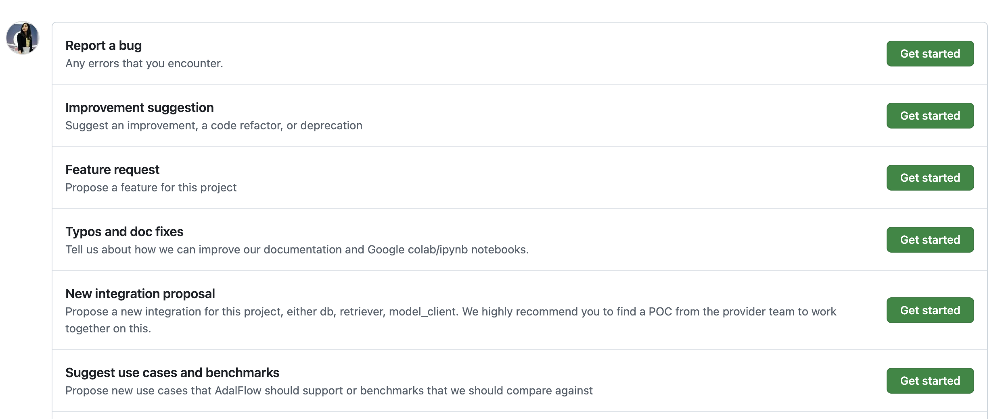
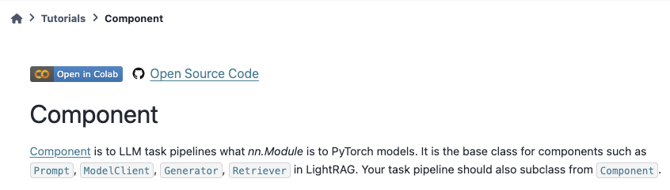

Contributing process
=======================================
Welcome to the AdalFlow community! We tried our best to make the process as simple and as clear as possible. We are open to any suggestions and advice to improve the process.
Please feel free to contact us on `Discord <https://discord.com/invite/ezzszrRZvT>`_ or use the `Github Discussion<https://github.com/SylphAI-Inc/AdalFlow/discussions>`.

Quick Start
^^^^^^^^^^^^^^^^^^^^^^^^^^^^^^^^^
1. The `Github issues < https>`_ is the best place to pick up a first task. Simply look for a task labeled `good first issue`.
2. The follow the `Code Contribution Guidelines <./contribute_to_code.html>`_ to start setting up your environment, coding and testing.
3. Last, you can follow the `Documentation Contribution Guidelines <./contribute_to_document.html>`_ to write documentation for your code.
4. Check out the last section on `PR & Review Process <#pr-review-process>`_ to complete the review and iteration process. We are trying out best to maximize both your learning and the quality of the library.

.. note::

   You can use 👍 to indicate that you want a particular issue to be addressed.

Part 1: Structuring
^^^^^^^^^^^^^^^^^^^^^^^^^^^^^^^^^
To go deeper, we will explain our repo structure, issue and label system.

..  what to contribute(with examples), contributing steps with proposal/discussion/coding/testing/documentation/pr/review process.
.. The coding and testing will be discussed more in details in `Code Contribution Guidelines <./contribute_to_code.html>`_ and the documentation will be discussed in `Documentation Contribution Guidelines <./contribute_to_document.html>`_.

Repo Structure
~~~~~~~~~~~~~~~~~~~~~~~~~~~~~~
We have a clear structure for the repo. The repo is divided into 6 subdirectories:

.. code-block:: text

   .
   ├── .github/
   ├── adalflow/
   │   ├── adalflow/
   │   ├── tests/
   |   ├── pyproject.toml
   ├── docs/
   |   |── pyproject.toml
   ├── tutorials/
   ├── use_cases/
   ├── benchmarks/
   ├── notebooks/
   |   ├── tutorials/
   |   ├── use_cases/
   |   ├── benchmarks/
   ├── .env_example
   ├── .gitattributes
   ├── .gitignore
   ├── .pre-commit-config.yaml
   ├── CNAME
   ├── LICENSE.md
   ├── README.md
   ├── SETUP.md
   ├── poetry.lock
   ├── pyproject.toml

The `/adalflow` directory contains the source code for the `AdalFlow` library, it has its soource code and tests, along with its own `pyproject.toml` file.
The `docs` directory contains the documentation for the `AdalFlow` library, it has its own `pyproject.toml` file too.
We use `reStructuredText` for the documentation. Please refer to `Documentation Contribution Guidelines <./contribute_to_document.html>`_ for more details.

Besides, we have `tutorials`, `use_cases`, and `benchmarks` directories for the tutorials, use cases, and benchmarks of the `AdalFlow` library.
`notebooks` directory contains all notebooks that are used across `tutorials`, `use_cases`, and `benchmarks`.

Issue & Label System
~~~~~~~~~~~~~~~~~~~~~~~~~~~~~~
We use issues to manage our bugs, features, and discussions.
We carefully designed 13 labels to categorize these issues.

.. figure:: ../_static/images/adalflow_issues.png
   :alt: AdalFlow Issues
   :align: center
   :width: 700px

   **Type**: The type of the issue, such as bug, feature, or discussion.

We use three categories of labels in parallel:

* Type of issue: There are 7 types of issues. We use `[adalflow]` to indicate the issue is related to `AdalFlow` source code under the `/adalflow` directory. Under this directory, we have two subdirectories: `adalflow` for the source code and `tests` for the test code.  You can suggest `integration`, `improvement`, `core feature`, `bug` here. Additionally, you can `documentation` for things located in the `/docs`, `/tutorials`, and `/notebooks` directories. "new use cases/benchmarks" is for new use cases or benchmarks located in the `/use_cases` and `/benchmarks` directories. "question" is for general questions.
* How to proceed: There are 4 types of issues. We use `good first issue` to indicate the issue is suitable for new contributors. We use `wontfix` to indicate the issue is not suitable for the library. We use `duplicate` to indicate the issue is a duplicate of another issue. `help wanted` we indicates `priority signal`, `discussion`, and `pr` are needed.
* Priority: There are 3 types of issues. We use `P0` to indicate the issue is the highest priority. We use `P1` to indicate the issue is the second highest priority. We use `P2` to indicate the issue is the lowest priority.

.. list-table:: Type of issue, How to proceed, and Priority
   :header-rows: 1
   :widths: 40 60 20

   * - Type of issue (7 labels)
     - How to proceed (3 labels)
     - Priority (3 labels)
   * - [adalflow] suggest integration
     -
     -
   * - [adalflow] suggest improvement
     - wontfix
     - P0
   * - [adalflow] suggest core feature
     - good first issue
     -
   * - new use cases/benchmarks
     - duplicate (aggregate) and close one
     - P1
   * - [adalflow] bug
     - help wanted
     - P2
   * - question
     -
     -
   * - documentation
     -
     -

How to create an issue?
~~~~~~~~~~~~~~~~~~~~~~~~~~~~~~
We created five templates to make it easy for you to create an issue.

   5 templates for creating issues

Each template will automatically have labels assigned to them.

How to assign priority?
~~~~~~~~~~~~~~~~~~~~~~~~~~~~~~
Besides our team to mark the priority with our best judgement, we allow the community to give us more signals on the priority.
You can use 👍 to indicate the importance of a particular issue to you.
We will take the `# of 👍 / time_period` as a signal to the priority too.

Part 2: What to contribute
^^^^^^^^^^^^^^^^^^^^^^^^^^^^^^^^^
This section explains more details on how each issue will relate to our codebase. We will list some example prs to help you understand better.
The following table will provide an quick overview. We will provide more details in each subsection on each type of contributions.

.. list-table:: What to Contribute (by 7 Labels) and Example PRs
   :header-rows: 1
   :widths: 20 50 30

   * - Label
     - Contribution Suggestions
     - Example Issue/PR
   * - [adalflow] bug
     - Fix bugs reported in issues, can relate to /adalflow code or /tutorials/user_cases/benchmarks.
     - `Issue 134 <https://github.com/SylphAI-Inc/AdalFlow/issues/134>`_ and `PR 135 <https://github.com/SylphAI-Inc/AdalFlow/pull/135>`_
   * - [adalflow] suggest integration
     - Add new integrations with model inference SDKs (:ref:`model_client<tutorials-model_client>`) or database retrievers (:ref:`retriever<tutorials-retriever>`) or tools or other libraries/frameworks.
     - `Ollama integration request <https://github.com/SylphAI-Inc/AdalFlow/issues/96>`_ and `PR 97 <https://github.com/SylphAI-Inc/AdalFlow/pull/97>`_. This often involves tests, tutorial, and documentation.
   * - [adalflow] suggest improvement
     - Enhance existing features for better performance or usability, can relate to /adalflow code or /tutorials/user_cases/benchmarks.
     - `Stream the response request <https://github.com/SylphAI-Inc/AdalFlow/issues/149>`_ and `PR 158 <https://github.com/SylphAI-Inc/AdalFlow/pull/158>`_.
   * - [adalflow] suggest core feature
     - Develop **new** core functionalities in `/adalflow` directory, such as `text_splitter` or `memory`.
     -
   * - new use cases/benchmarks
     - Design benchmarks or propose new use cases for `adalflow`.
     -
   * - documentation
     - Improve existing documentation under `/docs` or `/notebooks` directories or create new documentation for existing code.
     - `Issue 194<https://github.com/SylphAI-Inc/AdalFlow/issues/194>`_, `Issue 123<https://github.com/SylphAI-Inc/AdalFlow/issues/123>`_,  and `PR 260<https://github.com/SylphAI-Inc/AdalFlow/pull/260>`_.
   * - question
     - Answer user queries or provide clarifications about the library.
     -

Part 3: Contributing Steps
^^^^^^^^^^^^^^^^^^^^^^^^^^^^^^^^^

Once you know what you want to contribute, you need to make sure you follow these steps to ensure the quality of your contribution.

1. **Track it.** Create the issue if it doesn't exist yet.
2. **Learn enough context.** Ensure you read relavant documentation, code inside and outside of AdalFlow. This includes :ref:`tutorials<source-tutorials>`, :ref:`use_cases<use_cases>`, and even :ref:`API references<apis>` and tests within `/adalflow/tests` to understand everything you need to know. We will show more examples for each type of contribution in the next section. For integration, you need to make sure your know the relevant SDKs and APIs. For documentation, you need to know the structure of the documentation and the writing style.
3. **Create a solution proposal and take inputs before working on it.** We encourage you to write down your *solution proposal in the comments of the issue*. Or sometimes you can use a publically accessible `Google Doc/Colab` to share your proposal. SylphAI team and the community can double-check your proposal and give you feedbacks before you start coding. This will be extremely necessary for more complicated features. Additionally, you can discuss in our `Discord <https://discord.com/invite/ezzszrRZvT>`_.
4. **Work on it.**  Follow the `PR & Review Process <#pr-review-process>`_ to start your coding, testing, documenting, and reviewing process.

Integrate a  model_client
~~~~~~~~~~~~~~~~~~~~~~~~~~~~~~
All existing :ref:`model clients<components-model_client>` are located in the `/adalflow/adalflow/components/model_client` directory.
The tutorial :ref:`model_client<tutorials-model_client>` will help you understand the base class and how it is designed.

In general, `OpenAI SDK <https://platform.openai.com/docs/quickstart>`_ is trending to the the industry standard.
And you can measure your targetting SDKs by the difference between these two.
But overall, the OPENAI integration consists of: coding, testing, documentation.

Coding includes:

1. A :ref:`OpenAIClient<components-model_client-openai_client>` class that inherits from the base class :ref:`ModelClient<core.model_client>`.
2. Add the `sdk package` as an optional package in the `adalflow/pyproject.toml` file.
3. Add the `sdk package` as lazy import in the `adalflow/adalflow/utils/lazy_import.py` file.
4. Call the lazy import in the `adalflow/adalflow/components/model_client/__init__.py` file.
5. Import the new client in the `adalflow/adalflow/__init__.py` file so that we can call it directly from the `adalflow` package.

Testing includes:

1. Create a test file `test_XX_client.py` in the `adalflow/tests/` directory. You can use `test_openai_client.py` as a reference.
2. Add the package to the `adalflow/pyproject.toml` file under the `[tool.poetry.group.test.dependencies]` section.
3. Add the test case for the new client in the test file.
4. Follow the `adalflow/tests/README.md` to run the test.

Documentation includes:

1. Add examples on how to use the new client in the `tutorials` directory. You can use `tutorials/ollama_client_note.py` as a reference.
2. Make sure you add the new client package in the root `pyproject.toml` file under the `[tool.poetry.dependencies]` section.
3. Ensure the API reference is correctly rendenered in the `docs` directory.
   For example, with `ollama_client`, you need to add the following line in the `docs/source/apis/components/index.rst` file:

   .. code-block:: text

      components.model_client.ollama_client

4. Add examplary API configurations in the root `.env_example` file.

This `ollama_client PR <https://github.com/SylphAI-Inc/AdalFlow/pull/97>`_ is a good example of how to integrate a new model client.

Integrate a database retriever
~~~~~~~~~~~~~~~~~~~~~~~~~~~~~~~~~~~
All existing :ref:`retrievers<components-retriever>` are located in the `/adalflow/adalflow/components/retriever` directory.
The tutorial :ref:`retriever<tutorials-retriever>` will help you understand the base class and how it is designed.

The process is quite similar to integrating a model client. For documentation, ensure you add an example in :ref:`retriever<tutorials-retriever>`.

This `qdrant_retriever PR <https://github.com/SylphAI-Inc/AdalFlow/pull/165>`_ is a good example of how to integrate a new database retriever.

Add notebooks for existing/new tutorials/use_cases/benchmarks
~~~~~~~~~~~~~~~~~~~~~~~~~~~~~~~~~~~~~~~~~~~~~~~~~~~~~~~~~~~~~~

   :align: center
   :width: 700px

   Code samples for tutorials

.. note::
  For how to add a new notebook, please follow the `README.md <https://github.com/SylphAI-Inc/AdalFlow/blob/main/notebooks/README.md>`_ in the `notebooks` directory.

**Tutorials**

For :ref:`tutorials<tutorials>` in our documentation, each tutorial is accompanied by two code files: one `XX_note.py` in `/tutorials` and one `adalflow_XX.ipynb` in `/notebooks/tutorials`.
You can help add the missing code file in tutorials and make sure to link them in the documentation like the above figure.
Here is one example issue and PR for adding a new tutorial: `Issue 192 <https://github.com/SylphAI-Inc/AdalFlow/issues/192>`_ and `PR 261 <https://github.com/SylphAI-Inc/AdalFlow/pull/261>`_.

**Use Cases**

For :ref:`use_cases<use_cases>` in our documentation, each use case is accompanied by source code in `/use_cases` and a notebook in `/notebooks/use_cases`.
For our existing use cases, we do not always have the corresponding notebooks. You can help add the missing notebooks for the existing use cases.

**Benchmarks**

So far, we are still working on the code in the `/benchmarks` directory. We will need help on addint the documentation along with the code.

Part 4: Pull Request Process
^^^^^^^^^^^^^^^^^^^^^^^^^^^^^^^^^

Prepare the codebase
~~~~~~~~~~~~~~~~~~~~~~~~~

Before you can start a pull request, you need to follow these steps and this `Github official fork guide <https://docs.github.com/en/pull-requests/collaborating-with-pull-requests/working-with-forks/fork-a-repo?tool=webui>`_:

1. **Fork the repository.**
   You can fork the repository by clicking the `Fork` button on the top right corner of the repository page.

2. **Clone the repository.**
   You can clone the repository by running the following command in your terminal:

   .. code-block:: bash

      git clone your_forked_repository_url

3. **Sync your fork.**

   Also, make sure your repository is in sync with the original owner's repository. You can do this by running the following commands:

   .. code-block:: bash

      git remote -v

   You will not see our repo in the list. You can add it by running the following command:

   .. code-block:: bash

      git remote add upstream https://github.com/SylphAI-Inc/AdalFlow.git

   Now, when you run `git remote -v`, you will see the upstream repo.
   Then, we can sync your fork with the upstream repo by running the following commands:

   .. code-block:: bash

      git fetch upstream
      git checkout main
      git merge upstream/main

   *Note: `fetch` will fetch the changes from the upstream repo, but it will not merge them into your local branch. `merge` will merge the changes from the upstream repo into your local branch.*
   For more detials, please refer to the `Github official syncing a fork guide <https://docs.github.com/en/pull-requests/collaborating-with-pull-requests/working-with-forks/syncing-a-fork>`_.

4. **Create a new branch.**
   Create a new branch to ensure your changes are isolated from the main codebase. You can do this by running the following command:

   .. code-block:: bash

      git checkout -b <issue_number>_<issue_title>

   Similarly, you always use step 3 to sync your branch with the upstream repo.
   Additionally, you can use the following commands to sync:

   .. code-block:: bash

     git fetch --all --prune
     git rebase upstream/main
     # follow git instructions to resolve conflicts
     git push origin your_branch_name

Work on your PR
~~~~~~~~~~~~~~~~~~~~

1. **Before committing your changes.**
   We have a `.pre-commit-config.yaml` file in the root directory.
   We use `poetry` to manage our dependencies. You can install `poetry` by running the following command:

    .. code-block:: bash

        pip install poetry

    You can install the dependencies by running the following command:

    .. code-block:: bash

        poetry install

    Then you can activate the environment by running the following command:

    .. code-block:: bash

        poetry shell

    Now, you can start to commit your changes from the `/adalflow` directory with `poetry` environment activated.

2. **Commit your changes.**
   Once you have made your changes, you can commit them by running the following commands:

   .. code-block:: bash

      git add .
      git commit -m "Your commit message"
      git push origin your_branch_name

   If you face "permission denied" issue, you can refer to this `medium blog <https://medium.com/geekculture/how-to-change-your-github-remote-authentication-from-username-password-to-personal-access-token-64e527a766cf>`_ for help.

3. **Create a Pull Request.**
    Go to your forked repository on Github and click the `New Pull Request` button. Make sure you select the correct branch for the base and compare branches.
    Here we have a default `PR template <https://github.com/SylphAI-Inc/adalflow/blob/main/.github/PULL_REQUEST_TEMPLATE.md>`_ for you to fill in.

4. **Fill in the PR template.**
    Make sure you fill in the PR template with the necessary information. This will help the reviewers understand your changes better.

5. **Submit the PR.**
    We encourage you to submit the PR as soon as possible, even if it is not ready for review. You can mark it as a draft: (1) click the `Draft` button on the PR page, (2) add `[WIP]` to the PR title.

    .. figure:: ../_static/images/pr_draft.png
       :alt: Create a draft PR
       :align: center
       :width: 700px

        Create a draft PR

6. **Iterate your PR.**
    Once you have submitted the PR, the reviewers will review your changes and provide feedback. You can iterate your PR by making the necessary changes and pushing them to your branch. The reviewers will review your changes again.

7. **Merge your PR.**
    Once your PR is approved, the reviewers will merge your PR for you. You can also merge your PR by clicking the `Merge` button on the PR page.

Part 5: Review Process
^^^^^^^^^^^^^^^^^^^^^^^^^^^^^^^^^
For now, we will use the `PyTorch lightning's review guideline <https://github.com/Lightning-AI/pytorch-lightning/wiki/Review-guidelines>`_.

.. Environment
.. ^^^^^^^^^^^^^^^^^^^^^^^^^^^^^^^^^
.. When contributing, please note:
.. LightRAG separates the source code environment and documentation environment.

.. * To activate the code environment, you should run ``poetry install`` and ``poetry shell`` under ``./lightrag``. The ``./lightrag/pyproject.toml`` contains the dependencies for the ``LightRAG`` package.

.. * To activate the documentation environment, you can run ``poetry install`` and ``poetry shell`` under ``.``. The ``./pyproject.toml`` controls documentation dependencies.

.. .. admonition:: Resources
..    :class: highlight
