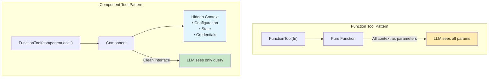
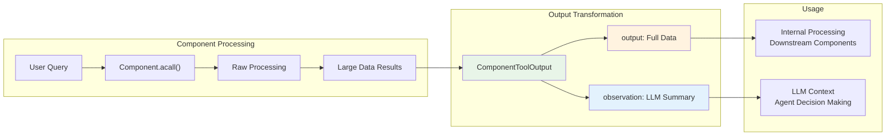
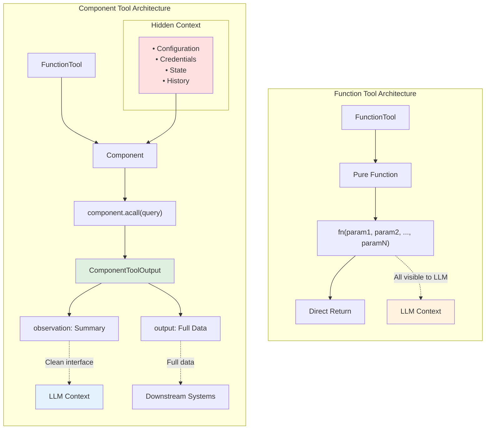

# Use Class method as a better function tool

`ComponentTool` is a design pattern in AdalFlow that leverages `FunctionTool` to wrap Component class methods as tools for LLM agents, providing enhanced context management and standardized output formatting compared to pure function tools.

## Overview

While `FunctionTool` can wrap any callable function, `ComponentTool` specifically refers to the pattern of using `FunctionTool` to wrap methods from `Component` subclasses. This pattern provides significant advantages for complex, stateful tools that need to maintain context across calls.



## Key Advantages Over Pure Functions

### 1. **Context Persistence**
Component tools can maintain persistent state and context that doesn't need to be passed as function parameters:

```python
# ❌ Pure function approach - parameters exposed to LLM
def search_web(query: str, conversation_id: str, user_preferences: dict, api_key: str):
    # All context must be parameters
    pass

# ✅ Component approach - context hidden from LLM
class SearchTool(Component):
    def __init__(self, conversation_id: str, user_preferences: dict, api_key: str):
        self.conversation_id = conversation_id
        self.user_preferences = user_preferences  # Persistent context
        self.api_key = api_key  # Hidden credentials
    
    def acall(self, query: str):
        # Only query parameter visible to LLM
        # Context available via self.*
        pass
```

### 2. **Controlled Output Formatting**
Component tools use `ComponentToolOutput` to separate raw output from LLM-visible observation:

```python
@dataclass
class ComponentToolOutput(DataClass):
    output: Any = field(default=None, metadata={"description": "The output of the tool"})
    observation: Optional[str] = field(default=None, metadata={"description": "The observation of the llm see of the output of the tool"})
    is_streaming: Optional[bool] = field(default=False, metadata={"description": "Whether the tool output is streaming"})
```

### 3. **Training/Optimization Support**
Components automatically support AdalFlow's training and optimization pipeline when wrapped as tools.

## ComponentToolOutput Pattern

The `ComponentToolOutput` class enables sophisticated output control:



### Raw Output vs Observation
- **`output`**: The complete, potentially large raw data
- **`observation`**: Concise, LLM-optimized summary of the output

```python
class SearchTool(Component):
    def call(self, query: str, as_tool: bool = False) -> Union[ComponentToolOutput, SearchResults]:
        # Perform search - returns large SearchResults object
        search_results = self.search_engine.search(query)
        
        if as_tool:
            # Create concise observation for LLM
            observation = self.output_to_observation(search_results, query)
            return ComponentToolOutput(
                output=search_results,  # Full data for internal use
                observation=observation  # Concise summary for LLM
            )
        else:
            return search_results  # Raw data for programmatic use
```

### Observation Template Example
```python
def output_to_observation(self, output: SearchResults, query: str) -> str:
    template = """
    
    Answer: {{ output.answerBox }}
    __________________________
    
    
    
    Search Results:

    
    {{loop.index}}.
    Title: {{ result.title }} 
    Link: {{ result.link }}
    Snippet: {{ result.snippet }}
    
    Credibility Score: {{ result.credibility_score }}
    
    
    
    """
    observation = Prompt(template=template, prompt_kwargs={"output": output, "query": query})()
    return observation
```


## Component Tool vs Function Tool Comparison



| Aspect | Function Tool | Component Tool |
|--------|---------------|----------------|
| **State Management** | Stateless, parameters only | Persistent state across calls |
| **Context Hiding** | All context via parameters | Internal context hidden from LLM |
| **Output Control** | Direct function return | ComponentToolOutput with observation |
| **Training Support** | Limited | Full AdalFlow optimization support |
| **Complexity** | Simple functions | Complex, stateful operations |
| **Memory Usage** | Minimal | Higher due to persistent state |
| **Best For** | Utility functions, calculations | Search, planning, user interaction |

## Best Practices

### 1. **State Management**
```python
class MyTool(Component):
    def __init__(self, config: dict):
        super().__init__()
        # ✅ Store configuration, not per-call data
        self.config = config
        self.client = APIClient(config['api_key'])
        
        # ❌ Don't store call-specific data as instance variables
        # self.last_query = None  # This would leak between calls
```

### 2. **Output Formatting**
```python
def format_observation(self, data: Any) -> str:
    """Always provide concise, relevant observations for LLM"""
    if len(str(data)) < 1000:
        return str(data)  # Small data can be returned directly
    else:
        # Large data needs summarization
        return f"Retrieved {len(data)} items. Key findings: {self.summarize(data)}"
```

### 3. **Async Support**
```python
class AsyncTool(Component):
    async def acall(self, query: str) -> ComponentToolOutput:
        """Prefer async methods for I/O operations"""
        results = await self.async_operation(query)
        return ComponentToolOutput(
            output=results,
            observation=self.format_observation(results)
        )
```

### 4. **Error Handling**
```python
async def acall(self, query: str) -> ComponentToolOutput:
    try:
        results = await self.process(query)
        return ComponentToolOutput(
            output=results,
            observation=self.format_observation(results)
        )
    except Exception as e:
        return ComponentToolOutput(
            output={"error": str(e)},
            observation=f"Error occurred: {str(e)}"
        )
```

## Related Components

- [`FunctionTool`](./FunctionTool.md): Base tool wrapper for all callables
- [`Component`](./Component.md): Base class for trainable components
- [`Agent`](./Agent.md): Uses tools for extended capabilities
- [`Runner`](./Runner.md): Executes agents with tool support


