# Use Class method as a better function tool

`ComponentTool` is a design pattern in AdalFlow that leverages `FunctionTool` to wrap Component class methods as tools for LLM agents, providing enhanced context management and standardized output formatting compared to pure function tools.

## Overview

While `FunctionTool` can wrap any callable function, `ComponentTool` specifically refers to the pattern of using `FunctionTool` to wrap methods from `Component` subclasses. This pattern provides significant advantages for complex, stateful tools that need to maintain context across calls.


## Key Advantages Over Pure Functions

### 1. **Context Persistence**
Component tools can maintain persistent state and context that doesn't need to be passed as function parameters:

```python
# ❌ Pure function approach - parameters exposed to LLM
def search_web(query: str, conversation_id: str, user_preferences: dict, api_key: str):
    # All context must be parameters
    pass

# ✅ Component approach - context hidden from LLM
class SearchTool(Component):
    def __init__(self, conversation_id: str, user_preferences: dict, api_key: str):
        self.conversation_id = conversation_id
        self.user_preferences = user_preferences  # Persistent context
        self.api_key = api_key  # Hidden credentials

    def acall(self, query: str):
        # Only query parameter visible to LLM
        # Context available via self.*
        pass
```

### 2. **Controlled Output Formatting**
Component tools use `ComponentToolOutput` to separate raw output from LLM-visible observation:

```python
@dataclass
class ComponentToolOutput(DataClass):
    output: Any = field(default=None, metadata={"description": "The output of the tool"})
    observation: Optional[str] = field(default=None, metadata={"description": "The observation of the llm see of the output of the tool"})
    is_streaming: Optional[bool] = field(default=False, metadata={"description": "Whether the tool output is streaming"})
```

### 3. **Training/Optimization Support**
Components automatically support AdalFlow's training and optimization pipeline when wrapped as tools.

## ComponentToolOutput Pattern

The `ComponentToolOutput` class enables sophisticated output control:


### Raw Output vs Observation
- **`output`**: The complete, potentially large raw data
- **`observation`**: Concise, LLM-optimized summary of the output

```python
class SearchTool(Component):
    def call(self, query: str, as_tool: bool = False) -> Union[ComponentToolOutput, SearchResults]:
        # Perform search - returns large SearchResults object
        search_results = self.search_engine.search(query)

        if as_tool:
            # Create concise observation for LLM
            observation = self.output_to_observation(search_results, query)
            return ComponentToolOutput(
                output=search_results,  # Full data for internal use
                observation=observation  # Concise summary for LLM
            )
        else:
            return search_results  # Raw data for programmatic use
```

### Observation Template Example
```python
def output_to_observation(self, output: SearchResults, query: str) -> str:
    template = """
    
    Answer: {{ output.answerBox }}
    __________________________
    

    
    Search Results:

    
    {{loop.index}}.
    Title: {{ result.title }}
    Link: {{ result.link }}
    Snippet: {{ result.snippet }}
    
    Credibility Score: {{ result.credibility_score }}
    
    
    
    """
    observation = Prompt(template=template, prompt_kwargs={"output": output, "query": query})()
    return observation
```

## Real-World Examples

### 1. Search Tool with Context Persistence

```python
class SearchTool(Component):
    """Search tool with persistent configuration and credibility checking."""

    def __init__(self, model_client: ModelClient, model_kwargs: dict):
        super().__init__()
        # Persistent context - not exposed to LLM
        self.model_client = model_client
        self.model_kwargs = model_kwargs
        self.search_engine = SerpSearch()
        self.credibility_checker = self._setup_credibility_checker()

    def _setup_credibility_checker(self):
        """Internal setup - not a tool method"""
        return Generator(
            model_client=self.model_client,
            model_kwargs={**self.model_kwargs, "model": "gpt-3.5-turbo"},
            template=CREDIBILITY_TEMPLATE,
            use_cache=True,
        )

    async def acall(
        self,
        query: str,
        num_sources: int = 5,
        check_credibility: bool = True,
    ) -> ComponentToolOutput:
        """
        Search the web for information.

        Args:
            query: The search query
            num_sources: Number of sources to return
            check_credibility: Whether to check source credibility
        """
        # Use persistent context
        results = await self.search_engine.search(query, num_sources)

        if check_credibility:
            # Use persistent credibility checker
            results = await self._filter_by_credibility(results)

        # Format for LLM consumption
        observation = self.output_to_observation(results, query)

        return ComponentToolOutput(
            output=results,  # Full SearchResults object
            observation=observation  # Concise summary for LLM
        )

# Usage as ComponentTool
search_tool = SearchTool(
    model_client=OpenAIClient(),
    model_kwargs={"model": "gpt-4", "temperature": 0.1}
)
search_function_tool = FunctionTool(fn=search_tool.acall)
```

### 2. Permission Tool with Async Generators

```python
class PermissionTool(Component):
    """Tool that requests user permission before executing commands."""

    def __init__(self, permission_state: UserPermissionState):
        super().__init__()
        # Persistent permission state
        self.permission_state = permission_state

    async def acall(self, command: str) -> AsyncGenerator[ComponentToolOutput, None]:
        """
        Execute a command with user permission.

        Args:
            command: The command to execute
        """
        command_id = str(uuid.uuid4())

        # Request permission (non-blocking)
        self.permission_state.request_permission_or_response(command_id, command)

        # First yield: thinking state
        yield ComponentToolOutput(
            output={"think": f"requesting permission for: {command}"},
            is_streaming=True
        )

        # Wait for user response (blocking)
        response = await self.permission_state.wait_for_permission_or_response(command_id)

        # Execute based on permission
        if response == PermissionStatus.ACCEPT:
            result = await self._execute_command(command)
            observation = f"Command executed: {result}"
        else:
            observation = f"Command denied: {command}"

        # Final yield: result
        yield ComponentToolOutput(
            output={"command": command, "result": result},
            observation=observation
        )

# Usage with conversation context
permission_state = UserPermissionState(conversation_id="session_123")
permission_tool_component = PermissionTool(permission_state=permission_state)
permission_tool = FunctionTool(fn=permission_tool_component.acall)
```

### 3. Planning Agent with Complex State

```python
class PlannerAgent(Component):
    """Agent that creates search plans with conversation context."""

    def __init__(self, model_client: ModelClient, model_kwargs: dict):
        super().__init__()
        # Persistent planning context
        self.model_client = model_client
        self.conversation_history = []
        self.user_preferences = {}

        # Internal LLM for planning
        self.planner_llm = Generator(
            model_client=model_client,
            model_kwargs=model_kwargs,
            template=PLANNING_TEMPLATE,
            output_processors=DataClassParser(WebSearchPlan)
        )

    def call(
        self,
        query: str,
        instructions: Optional[str] = None,
        as_tool: bool = False
    ) -> Union[ComponentToolOutput, WebSearchPlan]:
        """
        Create a search plan for the given query.

        Args:
            query: The user's query
            instructions: Optional additional instructions
        """
        # Use conversation context
        prompt_kwargs = {
            "input_str": query,
            "instructions": instructions,
            "conversation_history": self.conversation_history,
            "user_preferences": self.user_preferences
        }

        plan = self.planner_llm.call(prompt_kwargs=prompt_kwargs).data

        # Update conversation history
        self.conversation_history.append({"query": query, "plan": plan})

        if as_tool:
            observation = self.output_to_observation(plan, query)
            return ComponentToolOutput(
                output=plan,  # Full WebSearchPlan object
                observation=observation  # Summary for LLM
            )
        else:
            return plan

# Usage in agent
planner_agent = PlannerAgent(
    model_client=OpenAIClient(),
    model_kwargs={"model": "gpt-3.5-turbo"}
)
planner_tool = FunctionTool(fn=planner_agent.call)
```

## Integration with Agent Framework

```mermaid
sequenceDiagram
    participant U as User
    participant R as Runner
    participant A as Agent
    participant CT as ComponentTool
    participant C as Component
    participant LLM as Language Model

    U->>R: Query
    R->>A: Execute with tools
    A->>LLM: Plan with available tools
    LLM->>A: Tool call decision
    A->>CT: FunctionTool.call()
    CT->>C: component.acall(query)

    Note over C: Accesses persistent<br/>context & state

    C->>C: Process with full context
    C->>CT: ComponentToolOutput

    Note over CT: Separates output<br/>from observation

    CT->>A: observation (for LLM)
    A->>LLM: Tool result
    LLM->>A: Next action/final answer
    A->>R: Result
    R->>U: Final response

    Note over C,A: Component maintains<br/>state across calls
```



### Agent Setup
```python
from adalflow.core import Agent, Runner
from adalflow.core.func_tool import FunctionTool

# Create component tools with persistent context
search_tool = SearchTool(
    model_client=OpenAIClient(),
    model_kwargs={"model": "gpt-3.5-turbo"},
    conversation_id="user_session_123",
    user_preferences={"academic_sources": True}
)

planner_tool = PlannerAgent(
    model_client=OpenAIClient(),
    model_kwargs={"model": "gpt-4"}
)

# Wrap as FunctionTools
search_function_tool = FunctionTool(fn=search_tool.acall)
planner_function_tool = FunctionTool(fn=planner_tool.call)

# Create agent with component tools
agent = Agent(
    name="ResearchAgent",
    role_desc="A research assistant with planning and search capabilities",
    model_client=OpenAIClient(),
    model_kwargs={"model": "gpt-4o"},
    tools=[planner_function_tool, search_function_tool],
    answer_data_type=str,
)

runner = Runner(agent=agent, max_steps=5)
```

### Execution Example
```python
async def main():
    query = "What are the latest developments in quantum computing?"

    # Agent automatically uses component tools with their persistent context
    result = await runner.acall(prompt_kwargs={"input_str": query})

    # Tools maintain state across calls within the conversation
    print(result.answer)

asyncio.run(main())
```

## Component Tool vs Function Tool Comparison


| Aspect | Function Tool | Component Tool |
|--------|---------------|----------------|
| **State Management** | Stateless, parameters only | Persistent state across calls |
| **Context Hiding** | All context via parameters | Internal context hidden from LLM |
| **Output Control** | Direct function return | ComponentToolOutput with observation |
| **Training Support** | Limited | Full AdalFlow optimization support |
| **Complexity** | Simple functions | Complex, stateful operations |
| **Memory Usage** | Minimal | Higher due to persistent state |
| **Best For** | Utility functions, calculations | Search, planning, user interaction |

## Best Practices

### 1. **State Management**
```python
class MyTool(Component):
    def __init__(self, config: dict):
        super().__init__()
        # ✅ Store configuration, not per-call data
        self.config = config
        self.client = APIClient(config['api_key'])

        # ❌ Don't store call-specific data as instance variables
        # self.last_query = None  # This would leak between calls
```

### 2. **Output Formatting**
```python
def format_observation(self, data: Any) -> str:
    """Always provide concise, relevant observations for LLM"""
    if len(str(data)) < 1000:
        return str(data)  # Small data can be returned directly
    else:
        # Large data needs summarization
        return f"Retrieved {len(data)} items. Key findings: {self.summarize(data)}"
```

### 3. **Async Support**
```python
class AsyncTool(Component):
    async def acall(self, query: str) -> ComponentToolOutput:
        """Prefer async methods for I/O operations"""
        results = await self.async_operation(query)
        return ComponentToolOutput(
            output=results,
            observation=self.format_observation(results)
        )
```

### 4. **Error Handling**
```python
async def acall(self, query: str) -> ComponentToolOutput:
    try:
        results = await self.process(query)
        return ComponentToolOutput(
            output=results,
            observation=self.format_observation(results)
        )
    except Exception as e:
        return ComponentToolOutput(
            output={"error": str(e)},
            observation=f"Error occurred: {str(e)}"
        )
```

## Related Components

- [`FunctionTool`](./FunctionTool.md): Base tool wrapper for all callables
- [`Component`](./Component.md): Base class for trainable components
- [`Agent`](./Agent.md): Uses tools for extended capabilities
- [`Runner`](./Runner.md): Executes agents with tool support

## Migration from Function Tools


### Before (Function Tool)
```python
def search_web(query: str, api_key: str, user_id: str, preferences: dict):
    # All context as parameters
    client = SearchClient(api_key)
    results = client.search(query, preferences)
    return results  # Raw output to LLM

search_tool = FunctionTool(search_web)
```

### After (Component Tool)
```python
class SearchTool(Component):
    def __init__(self, api_key: str, user_id: str, preferences: dict):
        super().__init__()
        self.client = SearchClient(api_key)  # Hidden context
        self.user_id = user_id
        self.preferences = preferences

    def acall(self, query: str) -> ComponentToolOutput:
        results = self.client.search(query, self.preferences)
        observation = self.format_for_llm(results)  # LLM-optimized
        return ComponentToolOutput(output=results, observation=observation)

search_tool_component = SearchTool(api_key="...", user_id="...", preferences={})
search_tool = FunctionTool(fn=search_tool_component.acall)
```

ComponentTool provides a powerful pattern for building sophisticated, context-aware tools that maintain clean interfaces while hiding implementation complexity from LLMs.
