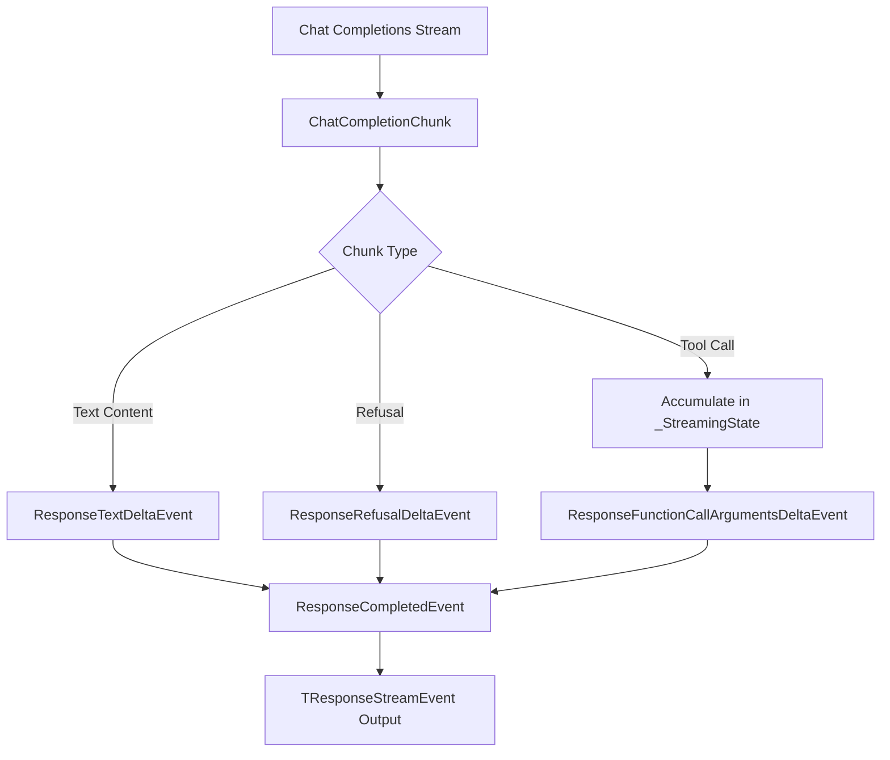
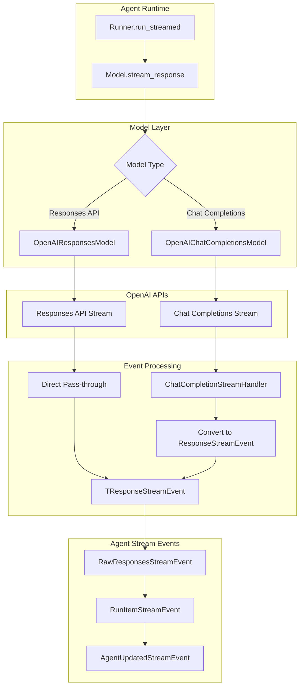
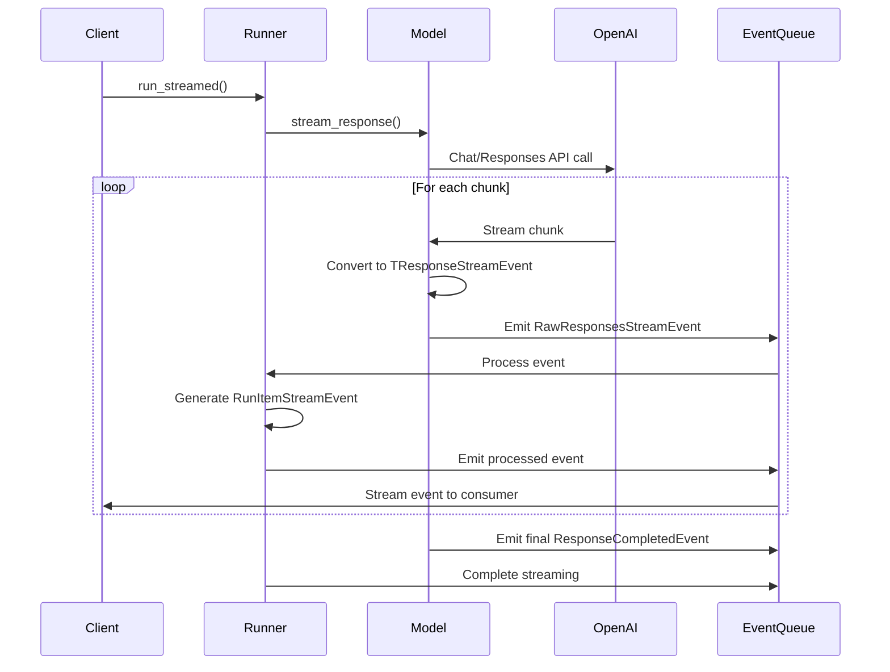
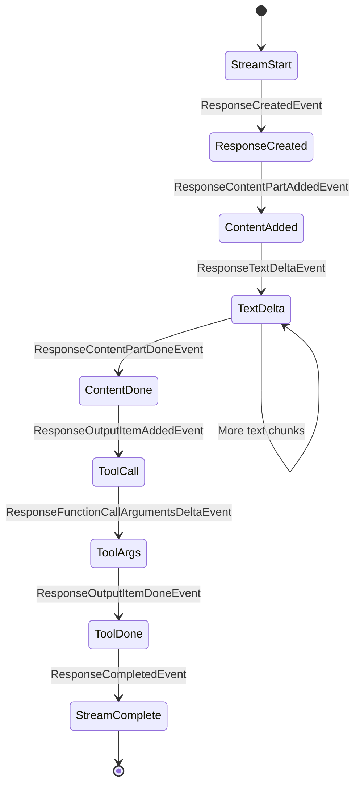

# Agent Streaming Architecture in OpenAI Agents SDK

The OpenAI Agents SDK implements a sophisticated streaming architecture that standardizes around the **OpenAI Responses API** format while providing compatibility with the **Chat Completions API** through a bridging mechanism. This document explains how the streaming system works, its key components, and data flow.

## Overview

The streaming system is designed around the principle that:
- **Responses API format is the standard**: All streaming events follow the `TResponseStreamEvent` type from OpenAI's Responses API
- **Chat Completions API compatibility**: The `OpenAIChatCompletionsModel` acts as a bridge, converting Chat Completions chunks into Responses API events
- **Unified streaming interface**: Both APIs produce the same `AsyncIterator[TResponseStreamEvent]` output

## Key Components

### 1. Core Streaming Types

**Location**: `/src/agents/items.py`
```python
TResponseStreamEvent = ResponseStreamEvent
```

This type alias represents the standardized streaming event from OpenAI's Responses API, which includes events like:
- `ResponseCreatedEvent`
- `ResponseTextDeltaEvent`
- `ResponseContentPartAddedEvent`
- `ResponseFunctionCallArgumentsDeltaEvent`
- `ResponseCompletedEvent`

### 2. Model Interface

**Location**: `/src/agents/models/interface.py`
```python
async def stream_response(
    self,
    system_instructions: str | None,
    input: str | list[TResponseInputItem],
    model_settings: ModelSettings,
    tools: list[Tool],
    output_schema: AgentOutputSchema | None,
    handoffs: list[Handoff],
    tracing: ModelTracing,
) -> AsyncIterator[TResponseStreamEvent]:
```

All model implementations must implement this unified streaming interface.

### 3. Response API Implementation

**Location**: `/src/agents/models/openai_responses.py`

The `OpenAIResponsesModel` provides native Responses API support:

```python
async def stream_response(self, ...) -> AsyncIterator[TResponseStreamEvent]:
    response_stream = await self._fetch_response(..., stream=True)
    async for event in response_stream:
        yield event  # Direct pass-through - no conversion needed
```

**Key characteristics**:
- **Direct streaming**: Events are passed through without conversion
- **Native format**: Already in `TResponseStreamEvent` format
- **Full feature support**: Supports all Responses API features (file search, computer use, etc.)

### 4. Chat Completions Bridge Implementation

**Location**: `/src/agents/models/openai_chatcompletions.py`

The `OpenAIChatCompletionsModel` acts as a **streaming adapter** that converts Chat Completions chunks into Responses API events:

#### Key Data Structures

```python
@dataclass
class _StreamingState:
    started: bool = False
    text_content_index_and_output: tuple[int, ResponseOutputText] | None = None
    refusal_content_index_and_output: tuple[int, ResponseOutputRefusal] | None = None
    function_calls: dict[int, ResponseFunctionToolCall] = field(default_factory=dict)
```

This state tracker accumulates Chat Completions deltas and reconstructs them as Responses API events.

#### Streaming Conversion Process



#### Step-by-Step Conversion Flow

1. **Initialize State**: Create `_StreamingState` to track streaming progress
2. **Process Chunks**: For each `ChatCompletionChunk`:
   - **Text Content**: Convert to `ResponseTextDeltaEvent`
   - **Tool Calls**: Accumulate in state (name/args come in fragments)
   - **Refusals**: Convert to `ResponseRefusalDeltaEvent`
3. **Emit Structured Events**:
   - `ResponseCreatedEvent` (start)
   - `ResponseContentPartAddedEvent` (new content part)
   - `ResponseTextDeltaEvent` (text deltas)
   - `ResponseOutputItemAddedEvent` (tool calls)
   - `ResponseContentPartDoneEvent` (content completion)
   - `ResponseCompletedEvent` (final)

#### Key Conversion Challenges

**Problem**: Chat Completions tool calls stream in fragments:
```python
# Chunk 1: {"tool_calls": [{"index": 0, "function": {"name": "get_weath"}}]}
# Chunk 2: {"tool_calls": [{"index": 0, "function": {"name": "er"}}]}
# Chunk 3: {"tool_calls": [{"index": 0, "function": {"arguments": "{\"city\""}}]}
```

**Solution**: Accumulate fragments in `_StreamingState.function_calls`:
```python
for tc_delta in delta.tool_calls:
    if tc_delta.index not in state.function_calls:
        state.function_calls[tc_delta.index] = ResponseFunctionToolCall(...)

    # Accumulate name and arguments
    state.function_calls[tc_delta.index].name += tc_function.name or ""
    state.function_calls[tc_delta.index].arguments += tc_function.arguments or ""
```

## Streaming Event Flow

### High-Level Architecture



### Event Types Hierarchy

**Location**: `/src/agents/stream_events.py`

```python
StreamEvent = Union[RawResponsesStreamEvent, RunItemStreamEvent, AgentUpdatedStreamEvent]
```

1. **`RawResponsesStreamEvent`**: Raw LLM events (direct from model)
2. **`RunItemStreamEvent`**: Processed agent events (messages, tool calls, handoffs)
3. **`AgentUpdatedStreamEvent`**: Agent handoff notifications

### Processing Pipeline



## Key Functions and Methods

### OpenAI Responses Model (`openai_responses.py`)

#### `stream_response()`
- **Purpose**: Native Responses API streaming
- **Flow**: Direct pass-through of OpenAI Responses events
- **Location**: Lines 125-171

```python
async def stream_response(self, ...) -> AsyncIterator[TResponseStreamEvent]:
    response_stream = await self._fetch_response(..., stream=True)
    async for event in response_stream:
        # Direct yield - no conversion needed
        yield event
```

### OpenAI Chat Completions Model (`openai_chatcompletions.py`)

#### `stream_response()`
- **Purpose**: Convert Chat Completions chunks to Responses API format
- **Flow**: Chunk → State Accumulation → Event Emission
- **Location**: Lines 160-421

#### `_StreamingState` Class
- **Purpose**: Track partial streaming data across chunks
- **Fields**:
  - `text_content_index_and_output`: Text content tracking
  - `function_calls`: Tool call accumulation
  - `refusal_content_index_and_output`: Refusal tracking

### Streaming State Management

```python
# Initialize tracking state
state = _StreamingState()

# Process each chunk
async for chunk in stream:
    delta = chunk.choices[0].delta

    # Handle text content
    if delta.content:
        if not state.text_content_index_and_output:
            # Initialize new content part
            state.text_content_index_and_output = (index, ResponseOutputText(...))
            yield ResponseContentPartAddedEvent(...)

        # Emit text delta
        yield ResponseTextDeltaEvent(delta=delta.content, ...)
        state.text_content_index_and_output[1].text += delta.content
```

## Data Structure Mapping

### Chat Completions → Responses API Conversion

| Chat Completions | Responses API | Notes |
|------------------|---------------|-------|
| `ChatCompletionChunk` | `TResponseStreamEvent` | Container type |
| `delta.content` | `ResponseTextDeltaEvent` | Text streaming |
| `delta.tool_calls` | `ResponseFunctionCallArgumentsDeltaEvent` | Tool calls (accumulated) |
| `delta.refusal` | `ResponseRefusalDeltaEvent` | Model refusals |
| `chunk.usage` | `ResponseCompletedEvent.usage` | Final usage stats |

### Event Lifecycle



## Integration Points

### Runner Integration

**Location**: `/src/agents/run.py`

The `Runner` class orchestrates streaming by:

1. **Creating Stream**: `run_streamed()` returns `RunResultStreaming`
2. **Event Processing**: Converts raw model events to semantic agent events
3. **Queue Management**: Uses `asyncio.Queue` for event distribution

```python
# Create streaming result container
streamed_result = RunResultStreaming(...)

# Process model stream events
async for raw_event in model.stream_response(...):
    # Emit raw event
    queue.put_nowait(RawResponsesStreamEvent(data=raw_event))

    # Process and emit semantic events
    if isinstance(raw_event, ResponseCompletedEvent):
        # Generate RunItemStreamEvent for new messages/tools
        processed_items = process_response(raw_event.response)
        for item in processed_items:
            queue.put_nowait(RunItemStreamEvent(item=item, name=item.type))
```

## Usage Examples

### Basic Streaming

```python
agent = Agent(...)
result = Runner.run_streamed(agent, "Hello")

async for event in result.stream_events():
    if event.type == "raw_response_event":
        # Raw LLM event
        llm_event = event.data
        if llm_event.type == "response.output_text.delta":
            print(llm_event.delta, end="")

    elif event.type == "run_item_stream_event":
        # Processed agent event
        if event.name == "message_output_created":
            print(f"New message: {event.item}")
```

### Event Filtering

```python
async for event in result.stream_events():
    match event:
        case RawResponsesStreamEvent(data=ResponseTextDeltaEvent(delta=text)):
            print(text, end="")
        case RunItemStreamEvent(name="tool_called", item=tool_call):
            print(f"Calling tool: {tool_call.name}")
        case AgentUpdatedStreamEvent(new_agent=agent):
            print(f"Switched to agent: {agent.name}")
```

## Benefits of This Architecture

1. **API Unification**: Both Chat Completions and Responses APIs produce identical streaming output
2. **Future Proofing**: New OpenAI APIs can be integrated by implementing the same interface
3. **Rich Event Types**: Supports text, tool calls, refusals, handoffs, and custom events
4. **Backward Compatibility**: Existing Chat Completions models work seamlessly
5. **Performance**: Minimal overhead for native Responses API, efficient conversion for Chat Completions

## Implementation Notes

### Fake IDs
Both models use `FAKE_RESPONSES_ID` for event identification since Chat Completions doesn't provide response IDs like the Responses API.

### Error Handling
Stream errors are propagated through the async iterator, maintaining consistency with OpenAI's streaming patterns.

### Memory Management
The `_StreamingState` is designed to have minimal memory footprint, accumulating only necessary data for event generation.

This architecture demonstrates how the OpenAI Agents SDK successfully bridges different API formats while maintaining a consistent, powerful streaming interface for developers.
