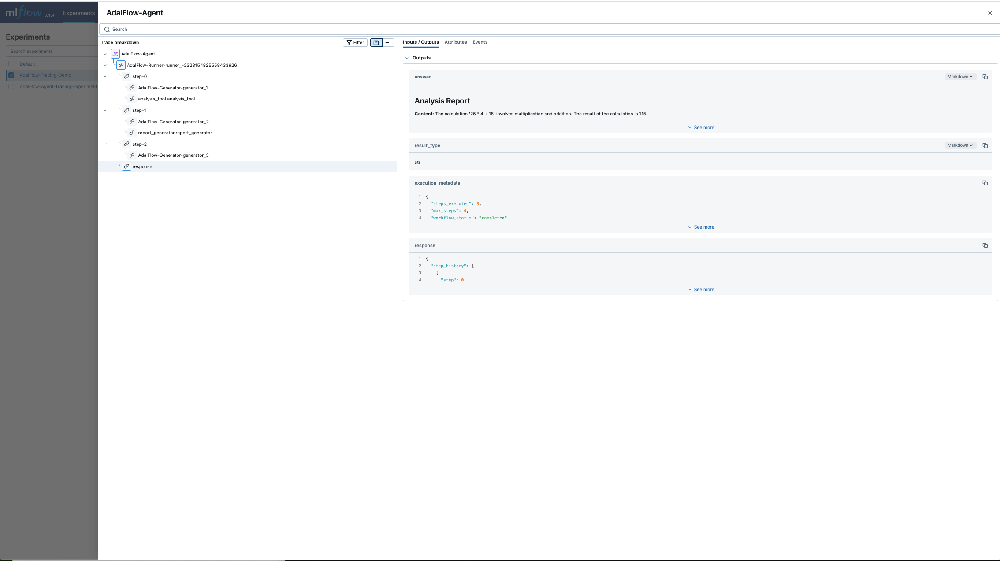

# Tracing

AdalFlow provides a comprehensive tracing system that is **compatible with OpenAI's tracing interface** and supports custom trace providers for integration with various observability backends like MLflow, Weights & Biases, and other visualization tools.

## Overview

AdalFlow's tracing system follows the OpenAI Agents SDK patterns and provides:

1. **OpenAI-Compatible Interface**: Full compatibility with OpenAI's trace provider format
2. **Multiple Backend Support**: MLflow, custom exporters, and JSON logging
3. **Hierarchical Tracing**: Traces contain spans for detailed execution tracking
4. **Automatic Instrumentation**: Built-in tracing for agents, generators, and tools
5. **Custom Trace Providers**: Support for any visualization library that implements OpenAI's trace provider interface

## Core Concepts

### Traces and Spans

- **Trace**: Represents a complete workflow execution (e.g., the high level task to the agent)
- **Span**: Represents individual operations within a trace (e.g., steps of the task, tool calls, LLM requests)
- **Span Data**: Contains detailed information about each operation

### OpenAI Compatibility

AdalFlow's tracing system implements the same interface as OpenAI's agents SDK, making it compatible with any visualization tool that supports OpenAI's trace provider format.

## Agent Tracing

AdalFlow automatically traces agent executions when tracing is enabled:

```python
def calculator(expression: str) -> str:
    """Simple calculator tool."""
    try:
        result = eval(expression)
        return f"Result: {result}"
    except Exception as e:
        return f"Error: {e}"

def text_processor(text: str) -> str:
    """Simple text processing tool."""
    return f"Processed: {text.upper().replace(' ', '_')}"

def agent_tracing_example():
    """Demonstrate agent tracing."""

    # Enable tracing
    set_tracing_disabled(False)

    # Create agent
    agent = Agent(
        name="SimpleAgent",
        tools=[
            FunctionTool(calculator),
            FunctionTool(text_processor),
        ],
        model_client=OpenAIClient(),
        model_kwargs={"model": "gpt-4o-mini", "temperature": 0.3},
        max_steps=3
    )

    # Create runner
    runner = Runner(agent=agent)

    # Execute agent - automatically traced
    result = runner.call(
        prompt_kwargs={
            "input_str": "Calculate 12 * 8 and then process the text 'hello world'"
        }
    )

    print(f"Agent result: {result.answer}")

    return result

# Run the example
agent_tracing_example()
```

## MLflow Integration

AdalFlow provides seamless integration with MLflow for enterprise-grade tracing.

**Prerequisites**: Start MLflow server before running this example:
```bash
mlflow server --host 127.0.0.1 --port 8000
```

```python
def demo_mlflow_integration():
    """Demonstrate MLflow integration for enterprise tracing."""
    def analysis_tool(data: str) -> str:
        """Analyze data and return insights."""
        return f"Analysis of '{data}': This appears to be a numerical calculation with result involving multiplication and addition."

    def report_generator(content: str) -> str:
        """Generate a formatted report."""
        return f"## Analysis Report\n\n**Content**: {content}\n\n**Generated**: Using AdalFlow tracing with MLflow integration"

    # Try to enable MLflow tracing
    mlflow_enabled = enable_mlflow_local(
        tracking_uri="http://localhost:8000",
        experiment_name="AdalFlow-Tracing-Demo",
        project_name="Agent-Workflows"
    )

    # Ensure tracing is enabled
    set_tracing_disabled(False)

    # Create agent
    agent = Agent(
        name="AnalysisAgent",
        tools=[
            FunctionTool(analysis_tool),
            FunctionTool(report_generator),
        ],
        model_client=OpenAIClient(),
        model_kwargs={"model": "gpt-4o", "temperature": 0.2},
        max_steps=4
    )

    runner = Runner(agent=agent)

    # Execute workflow - automatically traced to MLflow if available
    with trace(workflow_name="AdalFlow-Agent"):
        result = runner.call(
            prompt_kwargs={
                "input_str": "Analyze the calculation 25 * 4 + 15 and generate a report"
            }
        )

    print(f"Analysis complete: {result.answer}")

    return result

# Run the example
demo_mlflow_integration()
```

The above code results in the following image as shown below




## OpenAI Trace Provider Compatibility

AdalFlow's tracing system is designed to be compatible with any visualization library that supports OpenAI's trace provider interface one of which is MlFlow as shown above.

## Basic Tracing Patterns

### Tracing while Streaming Agent which has Async Generator Tools

When agents use async generator tools, its return type can be set to `ToolCallActivityRunItem` which will have it captured by tracing.

```python
async def demo_async_generator_tools_with_tracing():
    """Demonstrate tracing agent with async generator tools during streaming."""
    import asyncio
    from adalflow.core.types import RunItemStreamEvent, FinalOutputItem, ToolCallActivityRunItem

    # Define async generator tools
    async def data_processor(query: str):
        """Process data and yield intermediate results."""
        steps = [
            f"Analyzing query: '{query}'",
            f"Fetching relevant data for: {query}",
            f"Processing data patterns...",
            f"Generating insights from: {query}",
            f"Final analysis complete for: {query}"
        ]

        for i, step in enumerate(steps):
            await asyncio.sleep(0.5)  # Simulate processing time
            yield ToolCallActivityRunItem(data=f"Step {i+1}: {step}")

    async def report_generator(content: str):
        """Generate a report in multiple parts."""
        sections = [
            f"## Executive Summary\nBased on: {content}",
            f"## Detailed Analysis\nProcessing results from: {content}",
            f"## Recommendations\nSuggestions based on: {content}",
            f"## Conclusion\nFinal thoughts on: {content}"
        ]

        for section in sections:
            await asyncio.sleep(0.3)
            yield ToolCallActivityRunItem(data=section)

    async def live_monitor(system: str):
        """Monitor system status and yield live updates."""
        statuses = [
            f"🟢 {system} system online",
            f"📊 {system} performance: Normal",
            f"🔍 {system} scanning for issues",
            f"✅ {system} health check complete"
        ]

        for status in statuses:
            await asyncio.sleep(0.4)
            yield ToolCallActivityRunItem(data=status)

    # Enable tracing
    set_tracing_disabled(False)

    # Setup MLflow if available
    mlflow_enabled = enable_mlflow_local(
        tracking_uri="http://localhost:8000",
        experiment_name="AdalFlow-AsyncTools-Demo",
        project_name="AsyncGenerator-Workflows"
    )

    # Create agent with async generator tools
    agent = Agent(
        name="AsyncGeneratorAgent",
        tools=[
            FunctionTool(data_processor),
            FunctionTool(report_generator),
            FunctionTool(live_monitor),
        ],
        model_client=OpenAIClient(),
        model_kwargs={"model": "gpt-4o", "temperature": 0.2},
        max_steps=6
    )

    runner = Runner(agent=agent)

    # Execute with tracing context
    with trace(workflow_name="AsyncGenerator-Agent"):
        streaming_result = runner.astream(
            prompt_kwargs={
                "input_str": "Analyze the system performance data, generate a comprehensive report, and monitor the database system status"
            },
            model_kwargs={"stream": True}
        )

        async for event in streaming_result.stream_events():
            if isinstance(event, RunItemStreamEvent):
                if event.name == "agent.tool_call_activity":
                    # This captures async generator yields
                    if hasattr(event.item, 'data') and event.item.data:
                        print(f"📝 Yielded: {event.item.data}")

                elif isinstance(event.item, FinalOutputItem):
                    print(f"🎯 Final Result: {event.item.data.answer}")

# Run the example
asyncio.run(demo_async_generator_tools_with_tracing())
```

## Starting MLflow Server

To use MLflow integration, you need to start an MLflow server first:

```bash
# Install MLflow if not already installed
poetry add adalflow

# Start MLflow server (required before running tracing examples)
mlflow server --host 127.0.0.1 --port 8000

# Access MLflow UI at: http://localhost:8000
```

**Important**: Start the MLflow server before running any tracing examples that use MLflow integration. The server must be running for the tracing examples to work properly.

## Trace Reference

### Span Types

| Span Type | Description | Use Case |
|-----------|-------------|----------|
| `agent` | Agent execution | Complete agent workflows |
| `generator` | LLM generation | Model calls and responses |
| `tool` | Tool execution | Function/tool calls |
| `step` | Reasoning step | Agent reasoning steps |
| `computation` | Computation | Custom processing |
| `io` | Input/Output | File operations, API calls |
| `database` | Database | Database queries |
| `ml_inference` | ML Inference | Model predictions |

### Trace Processors

| Processor | Description | Use Case |
|-----------|-------------|----------|
| `MLflow` | MLflow integration | Enterprise observability |
| `JSON` | File-based logging | Development, debugging |
| `Console` | Terminal output | Real-time monitoring |
| `Custom` | User-defined | Integration with any backend that provides custom trace providers that implements OpenAI's trace provider interface |

AdalFlow's tracing system provides comprehensive observability for agent workflows while maintaining compatibility with OpenAI's interface, enabling integration with any visualization tool that supports the OpenAI trace provider format.
