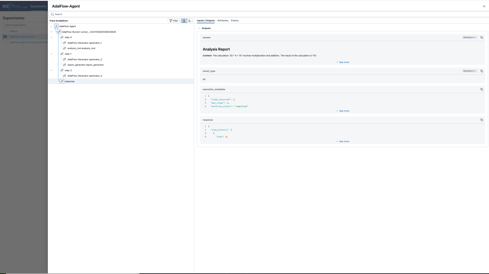
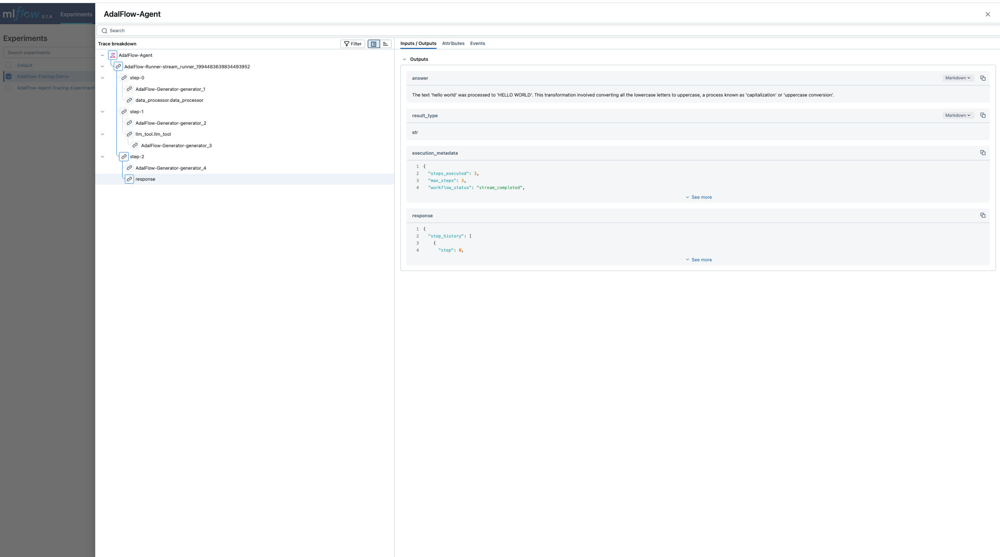

# Tracing

AdalFlow provides a comprehensive tracing system that is **compatible with OpenAI's tracing interface** and supports custom trace providers for integration with various observability backends like MLflow, Weights & Biases, and other visualization tools.

## Overview

AdalFlow's tracing system follows the OpenAI Agents SDK patterns and provides:

1. **OpenAI-Compatible Interface**: Full compatibility with OpenAI's trace provider format
2. **Multiple Backend Support**: MLflow, custom exporters, and JSON logging
3. **Hierarchical Tracing**: Traces contain spans for detailed execution tracking
4. **Automatic Instrumentation**: Built-in tracing for agents, generators, and tools
5. **Custom Trace Providers**: Support for any visualization library that implements OpenAI's trace provider interface

## Core Concepts

### Traces and Spans

- **Trace**: Represents a complete workflow execution (e.g., an agent conversation)
- **Span**: Represents individual operations within a trace (e.g., tool calls, LLM requests)
- **Span Data**: Contains detailed information about each operation

### OpenAI Compatibility

AdalFlow's tracing system implements the same interface as OpenAI's agents SDK, making it compatible with any visualization tool that supports OpenAI's trace provider format.

## Agent Tracing

AdalFlow automatically traces agent executions when tracing is enabled:

```python
from adalflow.utils import setup_env
from adalflow.components.agent import Agent, Runner
from adalflow.core.func_tool import FunctionTool
from adalflow.components.model_client.openai_client import OpenAIClient
from adalflow.tracing import set_tracing_disabled

# Setup environment
setup_env()

def calculator(expression: str) -> str:
    """Simple calculator tool."""
    try:
        result = eval(expression)
        return f"Result: {result}"
    except Exception as e:
        return f"Error: {e}"

def text_processor(text: str) -> str:
    """Simple text processing tool."""
    return f"Processed: {text.upper().replace(' ', '_')}"

def agent_tracing_example():
    """Demonstrate agent tracing."""
    
    # Enable tracing
    set_tracing_disabled(False)
    
    # Create agent
    agent = Agent(
        name="SimpleAgent",
        tools=[
            FunctionTool(calculator),
            FunctionTool(text_processor),
        ],
        model_client=OpenAIClient(),
        model_kwargs={"model": "gpt-4o-mini", "temperature": 0.3},
        max_steps=3
    )
    
    # Create runner
    runner = Runner(agent=agent)
    
    print("Executing agent with automatic tracing...")
    
    # Execute agent - automatically traced
    result = runner.call(
        prompt_kwargs={
            "input_str": "Calculate 12 * 8 and then process the text 'hello world'"
        }
    )
    
    print(f"Agent result: {result.answer}")
    print(f"Steps taken: {len(result.step_history)}")
    print("Automatic tracing captured:")
    print("   • Complete agent workflow")
    print("   • Individual tool calls")
    print("   • LLM generation steps")
    
    return result

# Run the example
agent_tracing_example()
```

## MLflow Integration

AdalFlow provides seamless integration with MLflow for enterprise-grade tracing.

**Prerequisites**: Start MLflow server before running this example:
```bash
mlflow server --host 127.0.0.1 --port 8000
```

```python
def demo_mlflow_integration():
    """Demonstrate MLflow integration for enterprise tracing."""
    print_section_header("MLflow Integration")
    
    def analysis_tool(data: str) -> str:
        """Analyze data and return insights."""
        return f"Analysis of '{data}': This appears to be a numerical calculation with result involving multiplication and addition."

    def report_generator(content: str) -> str:
        """Generate a formatted report."""
        return f"## Analysis Report\n\n**Content**: {content}\n\n**Generated**: Using AdalFlow tracing with MLflow integration"

    print("🔧 Attempting to enable MLflow tracing...")
    print("📌 Note: MLflow server should be running at http://localhost:8080")
    print("   Start with: mlflow server --host 127.0.0.1 --port 8080")
    
    # Try to enable MLflow tracing
    mlflow_enabled = enable_mlflow_local(
        tracking_uri="http://localhost:8000",
        experiment_name="AdalFlow-Tracing-Demo",
        project_name="Agent-Workflows"
    )
    
    if mlflow_enabled:
        print("✅ MLflow tracing enabled")
        print("📊 View traces at: http://localhost:8000")
    else:
        print("⚠️ MLflow not available, using default tracing")
        print("💡 To enable MLflow:")
        print("   1. Install: pip install mlflow")
        print("   2. Start server: mlflow server --host 127.0.0.1 --port 8000")
    
    # Ensure tracing is enabled
    set_tracing_disabled(False)
    
    # Create agent
    agent = Agent(
        name="AnalysisAgent",
        tools=[
            FunctionTool(analysis_tool),
            FunctionTool(report_generator),
        ],
        model_client=OpenAIClient(),
        model_kwargs={"model": "gpt-4o", "temperature": 0.2},
        max_steps=4
    )
    
    runner = Runner(agent=agent)
    
    print("\n🤖 Executing workflow with MLflow tracing...")
    # Execute workflow - automatically traced to MLflow if available
    with trace(workflow_name="AdalFlow-Agent"):
        result = runner.call(
            prompt_kwargs={
                "input_str": "Analyze the calculation 25 * 4 + 15 and generate a report"
            }
        )
    
    print(f"📝 Analysis complete: {result.answer}")
    
    if mlflow_enabled:
        print("\n📈 Trace data has been sent to MLflow!")
        print("🔍 Check the MLflow UI for detailed execution traces:")
        print("   • Navigate to: http://localhost:8000")
        print("   • Look for experiment: 'AdalFlow-Tracing-Demo'")
        print("   • View traces and spans for the complete workflow")
    else:
        print("📊 Trace data captured with default processors")
    
    return result

# Run the example
demo_mlflow_integration()
```

The above code results in the following image as shown below 




## OpenAI Trace Provider Compatibility

AdalFlow's tracing system is designed to be compatible with any visualization library that supports OpenAI's trace provider interface one of which is MlFlow as shown above. 

## Advanced Tracing Patterns

### Streaming with Tracing

Combine tracing with streaming for real-time observability:

```python
async def demo_streaming_with_tracing():
    """Demonstrate streaming execution with automatic tracing."""
    print_section_header("Streaming with Tracing")
    
    # Enable tracing
    set_tracing_disabled(False)

    enable_mlflow_local(
        tracking_uri="http://localhost:8000",
        experiment_name="AdalFlow-Tracing-Demo",
        project_name="Agent-Workflows"
    )
    
    # Create agent
    agent = Agent(
        name="StreamingTracedAgent",
        tools=[FunctionTool(data_processor)],
        model_client=OpenAIClient(),
        model_kwargs={"model": "gpt-4o", "temperature": 0.3},
        max_steps=3
    )
    
    runner = Runner(agent=agent)
    
    print("🚀 Starting streaming execution with tracing enabled")
    print("📊 Both streaming events and tracing data will be captured")
    
    with trace(workflow_name="AdalFlow-Agent"):
        streaming_result = runner.astream(
            prompt_kwargs={
                "input_str": "Process the text 'hello world' and explain what happened"
            },
            model_kwargs={"stream": True}
        )
    
        event_count = 0
        async for event in streaming_result.stream_events():
            event_count += 1
            if isinstance(event, RunItemStreamEvent):
                if event.name == "agent.tool_call_start":
                    print(f"🔧 Tool Call: {event.item.data.name}")
                elif event.name == "agent.tool_call_complete":
                    print(f"✅ Tool Complete")
                elif isinstance(event.item, FinalOutputItem):
                    print(f"🎯 Final Result: {event.item.data.answer}")
    
    print(f"📈 Processed {event_count} streaming events")
    print("📊 Trace data has been automatically captured alongside streaming")
```

The above script generates the following output:



## Starting MLflow Server

To use MLflow integration, you need to start an MLflow server first:

```bash
# Install MLflow if not already installed
poetry add adalflow

# Start MLflow server (required before running tracing examples)
mlflow server --host 127.0.0.1 --port 8000

# Access MLflow UI at: http://localhost:8000
```

**Important**: Start the MLflow server before running any tracing examples that use MLflow integration. The server must be running for the tracing examples to work properly.

## Trace Reference

### Span Types

| Span Type | Description | Use Case |
|-----------|-------------|----------|
| `agent` | Agent execution | Complete agent workflows |
| `generator` | LLM generation | Model calls and responses |
| `tool` | Tool execution | Function/tool calls |
| `step` | Reasoning step | Agent reasoning steps |
| `computation` | Computation | Custom processing |
| `io` | Input/Output | File operations, API calls |
| `database` | Database | Database queries |
| `ml_inference` | ML Inference | Model predictions |

### Trace Processors

| Processor | Description | Use Case |
|-----------|-------------|----------|
| `MLflow` | MLflow integration | Enterprise observability |
| `JSON` | File-based logging | Development, debugging |
| `Console` | Terminal output | Real-time monitoring |
| `Custom` | User-defined | Integration with any backend |

AdalFlow's tracing system provides comprehensive observability for agent workflows while maintaining compatibility with OpenAI's interface, enabling integration with any visualization tool that supports the OpenAI trace provider format.