# GeneratorOutput and Event System Design Document

## Overview

This document describes the design and architecture of AdalFlow's `GeneratorOutput` system and the event streaming architecture. The system provides a unified interface for handling LLM responses while maintaining both raw API responses and processed outputs, along with a comprehensive event streaming system for real-time execution monitoring.

## Table of Contents

1. [GeneratorOutput Architecture](#generatoroutput-architecture)
2. [Data Flow and Processing](#data-flow-and-processing)
3. [Event System Architecture](#event-system-architecture)
4. [Visual Diagrams](#visual-diagrams)
5. [Usage Patterns](#usage-patterns)
6. [Implementation Details](#implementation-details)

## GeneratorOutput Architecture

### Core Design Principles

The `GeneratorOutput` class serves as a universal container for LLM responses with the following key principles:

1. **Dual Response Storage**: Maintains both raw API responses and processed outputs
2. **Error Resilience**: Graceful handling of processing errors while preserving raw data
3. **Streaming Support**: Built-in support for real-time event streaming
4. **Type Safety**: Generic typing for processed output data
5. **Extensibility**: Support for reasoning models with thinking and tool use

### Class Structure

```python
@dataclass
class GeneratorOutput(DataClass, Generic[T_co]):
    # Identity and Metadata
    id: Optional[str]                    # Unique identifier
    metadata: Optional[Dict[str, object]]  # Additional metadata

    # Response Data (Dual Storage)
    data: T_co                                    # Processed, parsed output
    raw_response: Union[str, AsyncGenerator]      # Model-agnostic processed response
    api_response: Optional[Any]                   # Raw API response object

    # Extended Capabilities
    thinking: Optional[str]             # Reasoning model thoughts
    tool_use: Optional[Function]        # Tool usage information

    # Error Handling and Monitoring
    error: Optional[str]                # Error messages
    usage: Optional[CompletionUsage]    # Token usage tracking

    # Streaming Interface
    async def stream_events(self) -> AsyncIterator[RawResponsesStreamEvent]
```

### Field Relationships and Data Flow

```
┌─────────────────┐    Processing    ┌──────────────────┐    Parsing    ┌─────────────┐
│   api_response  │ ──────────────► │   raw_response   │ ────────────► │    data     │
│  (Raw API Obj) │                  │ (Processed Text) │               │ (Typed Obj) │
└─────────────────┘                  └──────────┬───────┘               └─────────────┘
                                                │                               │
                                                │                               │
                                                ▼                               ▼
                                         Stream Events                    Final Output
                                        Error Recovery
```

## Data Flow and Processing

### 1. API Response Storage (`api_response`)

The `api_response` field stores the **raw, unmodified response** from the model provider's API:

- **OpenAI**: `Response` object or `AsyncIterable` for streaming
- **Anthropic**: Native API response objects
- **Local Models**: Provider-specific response formats

**Key Characteristics**:
- Provider-specific format
- Complete metadata preservation
- Original error information
- Streaming capability (if supported)

### 2. Processed Response (`raw_response`)

The `raw_response` field contains the **model-agnostic, processed response** and serves as the **source for streaming events**:

- Can be a string (final processed text) or AsyncGenerator (for streaming)
- Extracted content from API response
- Standardized format across providers
- Cleaned and normalized
- Ready for further parsing
- **Source of RawResponsesStreamEvent when streaming**

**Type**: `Union[str, AsyncGenerator]`

**Processing Pipeline**:
```
API Response → Provider Parser → Standardized Response → raw_response → Stream Events
```

### 3. Parsed Data (`data`)

The `data` field holds the **final, typed output**:

- Type-safe parsed objects
- Application-specific formats
- Structured data (JSON, classes, etc.)

### Error Handling Strategy

```
┌─────────────────┐
│ API Call        │
└─────────┬───────┘
          │
          ▼
┌─────────────────┐    Success    ┌──────────────────┐    Success    ┌─────────────┐
│ api_response    │ ──────────────► │ raw_response     │ ────────────► │ data        │
│ (stored)        │                │ (processed)      │               │ (parsed)    │
└─────────────────┘                └──────────────────┘               └─────────────┘
          │                                 │                               │
          │ API Error                       │ Processing Error              │ Parsing Error
          ▼                                 ▼                               ▼
┌─────────────────┐                ┌──────────────────┐               ┌─────────────┐
│ error = API err │                │ error = Proc err │               │ error = Parse err │
│ data = None     │                │ data = None      │               │ data = None     │
│ raw_response=None│               │ raw_response=text│               │ raw_response=text│
└─────────────────┘                └──────────────────┘               └─────────────┘
```

## Event System Architecture

### Event Hierarchy

The event system provides real-time monitoring of execution through a two-tier event hierarchy:

#### 1. Raw Response Events (`RawResponsesStreamEvent`)

**Purpose**: Stream raw API events directly from the model provider
**Source**: Model provider APIs (OpenAI Response API, etc.)
**Content**: Unprocessed streaming chunks

```python
@dataclass
class RawResponsesStreamEvent:
    data: Any  # Raw provider-specific event
    type: Literal["raw_response_event"] = "raw_response_event"
```

#### 2. Run Item Events (`RunItemStreamEvent`)

**Purpose**: High-level execution events for application logic
**Source**: Runner execution pipeline
**Content**: Structured execution state changes

```python
@dataclass
class RunItemStreamEvent:
    name: Literal[
        "agent.tool_call_start",     # Tool about to execute
        "agent.tool_call_complete",  # Tool execution finished
        "agent.step_complete",       # Execution step completed
        "agent.final_output",        # Final processed output available
        "agent.execution_complete",  # Full execution finished
    ]
    item: RunItem  # Event-specific data container
    type: Literal["run_item_stream_event"] = "run_item_stream_event"
```

### Event Flow Architecture

```
┌─────────────────┐
│   LLM Provider  │
│   (OpenAI API)  │
└─────────┬───────┘
          │ Raw API Events
          ▼
┌─────────────────────────┐
│ GeneratorOutput         │
│ .stream_events()        │
│ → RawResponsesStreamEvent│
└─────────┬───────────────┘
          │
          ▼
┌─────────────────────────┐
│ Runner Pipeline         │
│ - Parse responses       │
│ - Execute tools         │
│ - Track steps           │
└─────────┬───────────────┘
          │ High-level Events
          ▼
┌─────────────────────────┐
│ RunItemStreamEvent      │
│ - agent.llm_response    │
│ - agent.tool_call_*     │
│ - agent.step_complete   │
│ - agent.execution_*     │
└─────────────────────────┘
```

### Run Item Types and Their Events

#### 1. ToolCallRunItem
- **Event**: `agent.tool_call_start`
- **Content**: Function object to be executed
- **Usage**: Pre-execution logging, intervention points

#### 2. ToolOutputRunItem
- **Event**: `agent.tool_call_complete`
- **Content**: Complete execution results
- **Usage**: Post-execution analysis, error handling

#### 3. StepRunItem
- **Event**: `agent.step_complete`
- **Content**: Full step execution summary
- **Usage**: Progress tracking, step-by-step analysis

#### 4. FinalOutputItem (for agent.final_output)
- **Event**: `agent.final_output`
- **Content**: Final processed output data
- **Usage**: Access to the final processed result before execution completion

#### 5. FinalOutputItem (for agent.execution_complete)
- **Event**: `agent.execution_complete`
- **Content**: Complete execution result with RunnerResponse and final_output
- **Usage**: Completion handling, final result extraction, comprehensive execution summary

## Visual Diagrams

### System Architecture Diagram

```mermaid
graph TB
    subgraph "AdalFlow Event System"
        subgraph "Model Clients"
            OpenAI[OpenAI API]
            Anthropic[Anthropic API]
            LocalLLM[Local LLM]
        end

        subgraph "GeneratorOutput"
            ApiResponse[api_response<br/>Raw API Object]
            RawResponse[raw_response<br/>Processed Response<br/>🔄 Stream Source]
            Data[data<br/>Typed Object]

            ApiResponse --> RawResponse
            RawResponse --> Data
        end

        subgraph "Runner Pipeline"
            Agent[Agent]
            ToolManager[Tool Manager]
            StepHistory[Step History]

            Agent --> ToolManager
            ToolManager --> StepHistory
        end

        subgraph "Event Streaming Layer"
            subgraph "Raw Events"
                RawEvent[RawResponsesStreamEvent<br/>• Raw API chunks<br/>• Provider events<br/>• Streaming data]
            end

            subgraph "Run Item Events"
                AgentEvents[RunItemStreamEvent<br/>• agent.tool_call_start<br/>• agent.tool_call_complete<br/>• agent.step_complete<br/>• agent.final_output<br/>• agent.execution_complete]
            end
        end

        subgraph "Consumer Layer"
            UI[UI Display<br/>• Progress<br/>• Reasoning<br/>• Tool calls]
            Monitor[Monitoring<br/>• Logging<br/>• Metrics<br/>• Debugging]
            External[External Systems<br/>• Webhooks<br/>• Analytics<br/>• Notifications]
        end

        OpenAI --> ApiResponse
        Anthropic --> ApiResponse
        LocalLLM --> ApiResponse

        GeneratorOutput --> Agent
        RawResponse --> RawEvent
        StepHistory --> AgentEvents

        RawEvent --> UI
        RawEvent --> Monitor
        AgentEvents --> UI
        AgentEvents --> Monitor
        AgentEvents --> External
    end
```



### Event Timeline Diagram


### RunItem Class Hierarchy

```mermaid
classDiagram
    class RunItem {
        <<Abstract Base>>
        +String id
        +String type
        +Any data
        +DateTime timestamp
    }

    class ToolCallRunItem {
        +String type = "tool_call"
        +Function function
    }

    class ToolOutputRunItem {
        +String type = "tool_output"
        +FunctionOutput function_output
    }

    class StepRunItem {
        +String type = "step"
        +StepOutput step_output
    }

    class FinalOutputItem {
        +String type = "final_output"
        +RunnerResponse runner_response
        +Any final_output
    }

    class RunItemStreamEvent {
        +String name
        +RunItem item
        +String type = "run_item_stream_event"
    }

    RunItem <|-- ToolCallRunItem
    RunItem <|-- ToolOutputRunItem
    RunItem <|-- StepRunItem
    RunItem <|-- FinalOutputItem

    RunItemStreamEvent --> RunItem : contains

    note for RunItemStreamEvent "Event Names:\n• agent.tool_call_start\n• agent.tool_call_complete\n• agent.step_complete\n• agent.final_output\n• agent.execution_complete"
```



## Usage Patterns

### 1. Basic Response Handling

```python
# Generate response
output = generator.call(prompt="What is AI?")

# Access different response levels
api_data = output.api_response      # Raw API object
text_data = output.raw_response     # Processed text
parsed_data = output.data          # Typed/parsed result

# Handle errors
if output.error:
    print(f"Error: {output.error}")
    # Still access available data
    fallback_text = output.raw_response
```

### 2. Streaming Event Consumption

```python
# Stream raw API events
async for event in output.stream_events():
    if isinstance(event, RawResponsesStreamEvent):
        print(f"Raw chunk: {event.data}")

# Stream execution events
result = runner.astream(prompt_kwargs)
async for event in result.stream_events():
    if isinstance(event, RunItemStreamEvent):
        if event.name == "agent.tool_call_start":
            print(f"Starting tool: {event.item.function.name}")
        elif event.name == "agent.final_output":
            print(f"Final processed output: {event.item.final_output}")
        elif event.name == "agent.execution_complete":
            print(f"Final result: {event.item.runner_response.answer}")
            print(f"Complete execution summary available")
```

### 3. Error Recovery Patterns

```python
# Graceful degradation
output = generator.call(prompt="Complex query")

if output.data:
    # Use fully processed data
    result = output.data
elif output.raw_response:
    # Fall back to raw text
    result = output.raw_response
elif output.api_response:
    # Last resort: manual parsing
    result = custom_parse(output.api_response)
else:
    # Complete failure
    raise Exception(f"Generation failed: {output.error}")
```

## Implementation Details

### Key Files and Classes

1. **`adalflow/core/types.py`**:
   - `GeneratorOutput` - Main response container
   - `RawResponsesStreamEvent` - Raw API event wrapper
   - `RunItemStreamEvent` - Execution event wrapper
   - `RunItem` hierarchy - Event data containers

2. **`adalflow/core/runner.py`**:
   - `Runner` - Execution orchestrator
   - `RunnerStreamingResult` - Streaming result container
   - Event generation and queuing logic

3. **`adalflow/components/model_client/openai_client.py`**:
   - OpenAI-specific response processing
   - API response to GeneratorOutput conversion
   - Streaming event handling

### Event Naming Conventions

The event naming follows a hierarchical pattern:

- **Namespace**: `agent.*` for core execution events
- **Action**: `call_start`, `call_complete`, `step_complete`, etc.
- **Scope**: Tool-level, step-level, execution-level

### Performance Considerations

- Raw responses are stored as strings to minimize memory usage
- API responses are kept as-is to preserve original data
- Event streaming uses generator patterns to avoid memory buildup
- Lazy evaluation of parsed data when possible

## Conclusion

The GeneratorOutput and event system provides a robust foundation for handling LLM responses in AdalFlow. The dual storage approach ensures both raw data preservation and convenient access to processed results, while the event system enables real-time monitoring and responsive user interfaces. The hierarchical event naming and structured Run Item types make the system extensible and maintainable for complex agent workflows.
